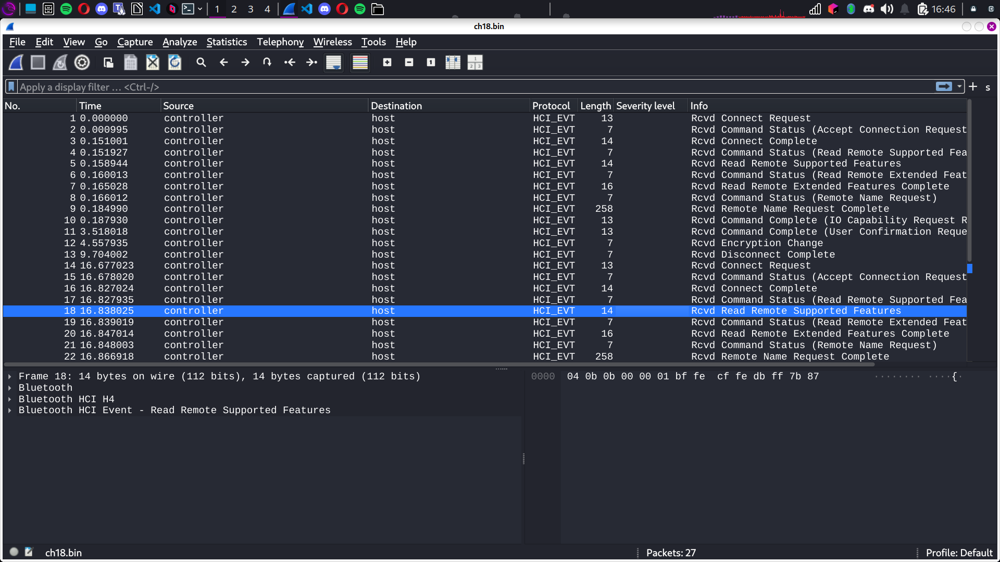

# **Bluetooth - Fichier inconnu**
**Points :** 15 
**Catégorie :** Google est ton ami  

---

### **Énoncé**  
Retrouvez les données normalement confidentielles contenues dans cette trame.


## **Étape 1 : Identification du fichier**  
- Votre ami, travaillant à l'ANSSI, a récupéré un fichier illisible provenant d'un échange entre un ordinateur et un téléphone. L’objectif est de découvrir le maximum d'informations sur ce téléphone.  
- Première action : utiliser la commande **`file ch18.bin`** pour obtenir des informations sur le fichier.  
- La commande nous informe que c'est un fichier **BTSnoop**, un format utilisé pour analyser les communications Bluetooth, ce qui est confirmé par l’énoncé du challenge.  

---
 
## **Étape 2 : Ouverture du fichier avec Wireshark**  
- **Wireshark** prend en charge ce format et peut lire les séquences Bluetooth. Ouvrons donc le fichier **ch18.bin** avec **Wireshark**.  
- Vous verrez apparaître la "discussion" entre l’ordinateur et le téléphone, détaillant les échanges Bluetooth.  

---

## **Étape 3 : Analyser les appareils Bluetooth**  
- Wireshark propose un outil pratique dans le menu **Wireless** (en anglais chez moi) -> **Bluetooth devices**.  
- Une fenêtre apparaîtra avec tous les appareils ayant participé à l'échange.  
- Voici ce que l’on y trouve :
  - **BD_ADDR** : l'adresse MAC du téléphone : `0C:B3:19:B9:4F:C6`  
  - **Name** : le nom du téléphone diffusé : `GT-S7390G`  

---

## **Étape 4 : Construction du flag**  
- Le flag est une concaténation de l’adresse MAC en **majuscule** et du nom tel quel.  
  - Cela donne : `0C:B3:19:B9:4F:C6GT-S7390G`  
  - Vous devez ensuite calculer le hash **SHA1** de cette chaîne :  
    `sha1(0C:B3:19:B9:4F:C6GT-S7390G)`  
  - Cela vous donne un résultat comme :  
    `c1d[...]22b`  

---

## **Flag du challenge**  
Le flag du challenge est :  
```
flag{[FLAG CACHÉ]}
```
