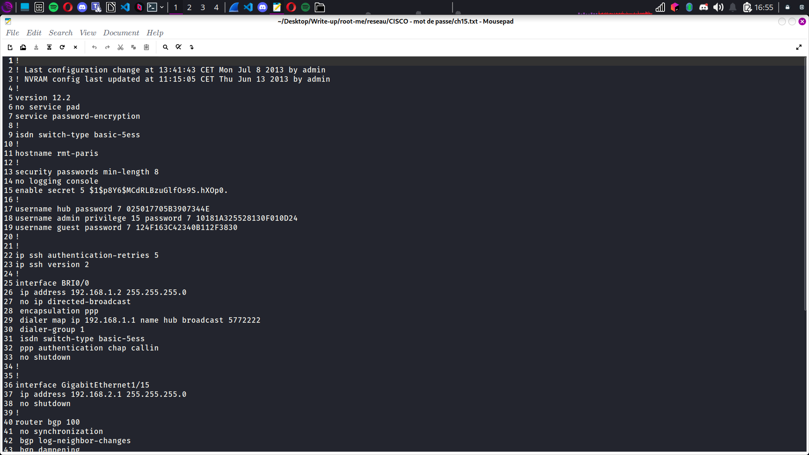

# Compte Rendu : CTF - Root Me Challenge

## **Challenge : CISCO - Mot de passe**  
- **Points :** 15   

---

## **Objectif**  
Récupérer le mot de passe "Enable" à partir des indices fournis, en utilisant les informations des mots de passe Cisco 7 et le hachage MD5.

---

## **Étape 1 : Identification des mots de passe Cisco 7**  
- **Observation :** Le système utilise un algorithme de chiffrement de mot de passe basique Cisco 7, facilement réversible.
 
- **Action :** Les mots de passe sont dans ce format :
```
username hub password 7 025017705B3907344E 
username admin privilege 15 password 7 10181A325528130F010D24 
username guest password 7 124F163C42340B112F3830 
password 7 144101205C3B29242A3B3C3927
```
- **Décodage des mots de passe Cisco 7 :**  
- 025017705B3907344E → **6sK0_hub**
- 10181A325528130F010D24 → **6sK0_admin**
- 124F163C42340B112F3830 → **6sK0_guest**
- 144101205C3B29242A3B3C3927 → **6sK0_console**

---

## **Étape 2 : Hypothèse pour le mot de passe "Enable"**  
- **Observation :** Le format de mot de passe suit un modèle : "6sK0" + _username_.
- **Hypothèse :** Le mot de passe "enable" devrait suivre ce même modèle et être **6sK0_enable**.

---

## **Étape 3 : Exploration du hachage MD5 de "enable"**  
1. **Analyse du hachage dans la configuration Cisco :**
```
enable secret 5 $1$p8Y6$MCdRLBzuGlfOs9S.hXOp0.
```
- **$1** : Type de hachage MD5.
- **$p8Y6** : Salage (4 caractères aléatoires en base64).
- **$MCdRLBzuGlfOs9S.hXOp0.** : Le hachage final MD5 avec le salage.

2. **Utilisation de la commande OpenSSL pour vérifier l'hachage :**
```
openssl passwd -1 -salt p8Y6 "6sK0_enable"
```

---

## **Étape 4 : Validation**  
- **Résultat obtenu :**
```
$1$p8Y6$MCdRLBzuGlfOs9S.hXOp0.
```
- Ce résultat correspond exactement au hachage MD5 affiché dans la configuration.

---

## **Étape 5 : Mot de passe trouvé**  
- **Mot de passe :** `[FLAG CACHÉ]`  
- **Conclusion :** Le mot de passe "enable" utilise le format "6sK0_" + nom d'utilisateur, et en vérifiant le hachage MD5, nous avons confirmé que le mot de passe est bien **[FLAG CACHÉ]**.

--- 

## **Conclusion**  
Ce challenge montre l'importance de bien sécuriser les mots de passe et de ne pas se contenter d'algorithmes de chiffrement simples, car des méthodes de décryptage existent et sont faciles à utiliser.
