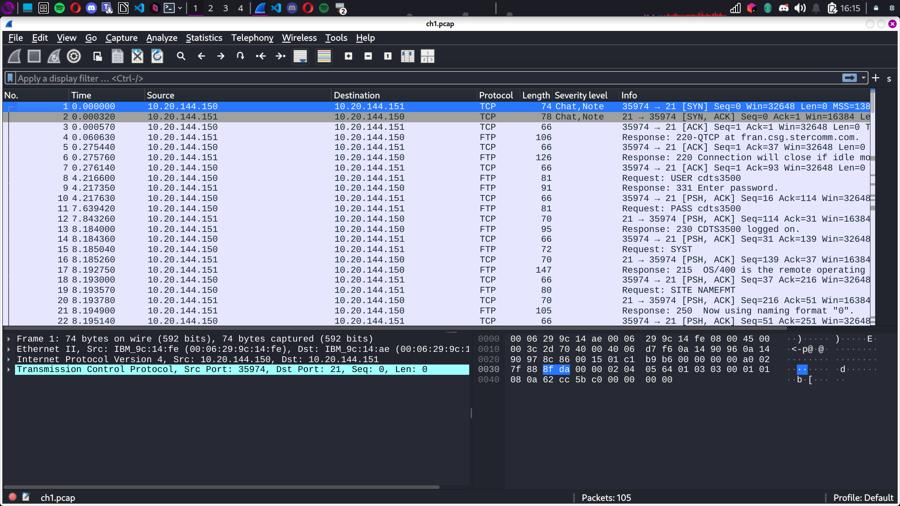

## **FTP - Authentification**  
**Points :** 5  
**Catégorie :** Analyse de capture réseau  

---

### **Énoncé**  
Un échange authentifié de fichier réalisé grâce au protocole FTP. Retrouvez le mot de passe utilisé par l’utilisateur.

---

### **Étapes : L’analyse avec Wireshark 🕵️**  

1. **Lancer Wireshark :**  
   Utilisez la commande suivante pour démarrer Wireshark avec les droits nécessaires :  
```
sudo wireshark
```
 
2. **Appliquer un filtre :**  
Dans les paramètres de filtrage, entrez le terme suivant pour isoler les échanges FTP :  
```
ftp
```

3. **Identifier les lignes clés :**  
- Surveillez les lignes où des informations sensibles circulent, comme :  
  ```
  9  4.217350  10.20.144.151  10.20.144.150  FTP  91  Response : 331 Enter password.
  ```  
- Ensuite, repérez la requête où le mot de passe est transmis en clair :  
  ```
  [FLAG CACHÉ]
  ```  

---

### **Résultat : Le mot de passe trouvé**  
Le mot de passe est :  
```
[FLAG CACHÉ]
```

---

### **Conclusion :**  
Ce challenge démontre la vulnérabilité du protocole FTP, qui transmet les identifiants en clair sur le réseau.  
🔒 **Conseil :** Utilisez des protocoles sécurisés comme SFTP ou FTPS pour protéger vos données sensibles.  

🎩 **Moralité :** Ne laissez pas vos mots de passe traîner en clair, sous peine de les voir s’envoler comme un papillon. 🦋  
