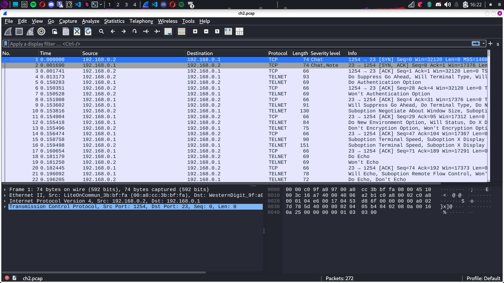

## **Étape 1 : Analyse de la capture réseau**  
- Nous sommes face à une capture de session **TELNET**. Objectif : retrouver le mot de passe de l’utilisateur.  
- Pas de panique, le protocole **Telnet** est connu et les specs sont fournies. Il s’agit de retrouver un mot de passe dans une capture de communication réseau. Facile, non ? 😎  

---

## **Étape 2 : Ouvrir la capture avec Wireshark**  
- Récupérez la capture et ouvrez-la avec **Wireshark**. Vous allez voir un échange assez chaotique entre deux machines.  
- Les trois premiers segments TCP montrent l’ouverture de la connexion grâce aux bytes : **SYN, SYN/ACK, ACK**. Les informations de connexion ne sont donc pas bien loin.

 

---

## **Étape 3 : Utilisation de "Follow TCP Stream"**  
- Pour faciliter l’analyse, **Wireshark** propose une option super utile : **"Follow TCP Stream"**.  
- Faites un clic droit sur l’une des trames, sélectionnez l’option, et une boîte de dialogue apparaîtra avec du texte assez confus, mais ne vous laissez pas intimider. 🎯  

---

## **Étape 4 : Repérer le mot de passe**  
- À moins d’être aveugle, vous devriez repérer **le mot de passe** de l’utilisateur dans la capture, affiché sous cette forme :  
```
Password=user
```
- Voilà, le mot de passe de l’utilisateur est **"user"** ! Testez-le, et vous verrez que l’épreuve est validée. ✔️  

---

## **Flag du challenge**  
Le flag du challenge est :  
```
flag{user}
```


---

## **Conclusion : Une analyse simple, mais efficace 🔍**  
Ce challenge est une belle occasion d’apprendre à utiliser Wireshark pour analyser les captures de réseau et repérer des informations utiles, comme des mots de passe. Rien de trop compliqué ici, mais l’outil et la méthode peuvent être super puissants. 🛠  
