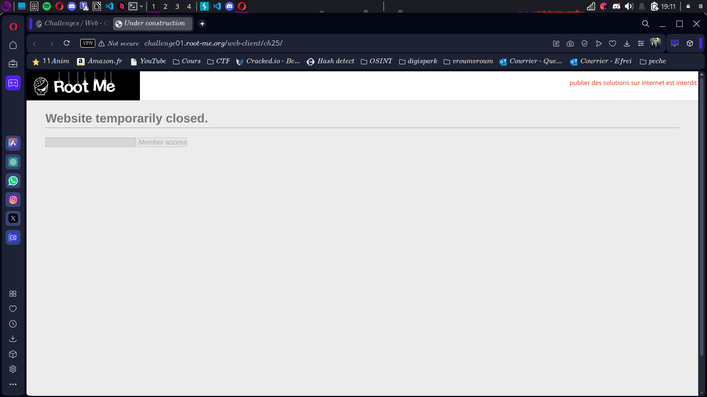
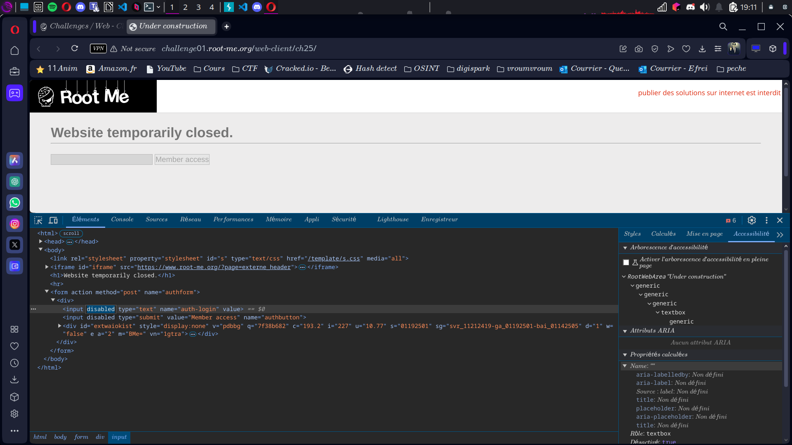
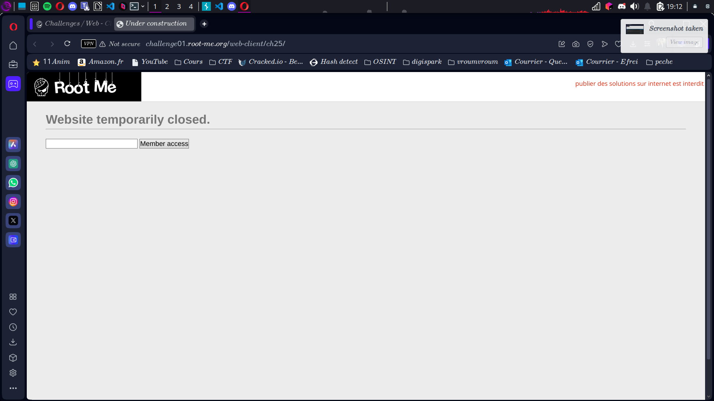

# Compte Rendu : CTF - Root Me Challenge

## **Challenge : HTML - Boutons Désactivés**  
- **Points :** 5  
- **Lien :** [http://challenge01.root-me.org/web-client/ch25/](http://challenge01.root-me.org/web-client/ch25/)

---

## **Objectif**  
Contourner la désactivation des boutons pour obtenir le flag.

---

## **Étape 1 : Arrivée sur la page**  
- La page contient un champ texte et un bouton grisé, semblant être désactivé car le site est en construction.  
- **Screen associé :**   

---

## **Étape 2 : Inspection de l'élément**  
- En inspectant le code source, on remarque que les boutons sont désactivés grâce à l'attribut `disabled`.  
- **Action :** En modifiant l'HTML via l'outil de développement (clic droit > inspecter), nous supprimons l'attribut `disabled` des boutons.  
- **Screen associé :**   

---

## **Étape 3 : Soumission et récupération du flag**  
- Une fois l'attribut `disabled` supprimé, nous entrons un pseudo aléatoire et cliquons sur le bouton. Le flag apparaît.  

- **Screen associé :**  

---

## **Résultats**  
- **Vulnérabilité exploitée :** Contournement de l'attribut `disabled` dans l'HTML.  
- **Flag obtenu :**  
```
flag{[FLAG CACHÉ]}
```

---

## **Conclusion**  
Ce challenge met en évidence la simplicité avec laquelle un attaquant peut contourner des éléments de sécurité côté client comme les boutons désactivés, en manipulant simplement le code HTML via les outils de développement du navigateur.
