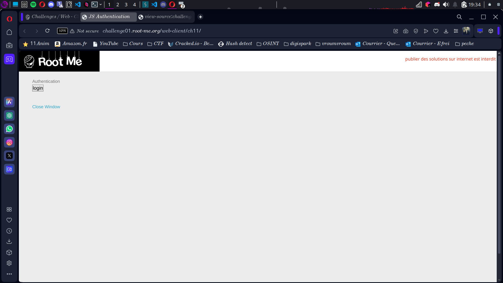
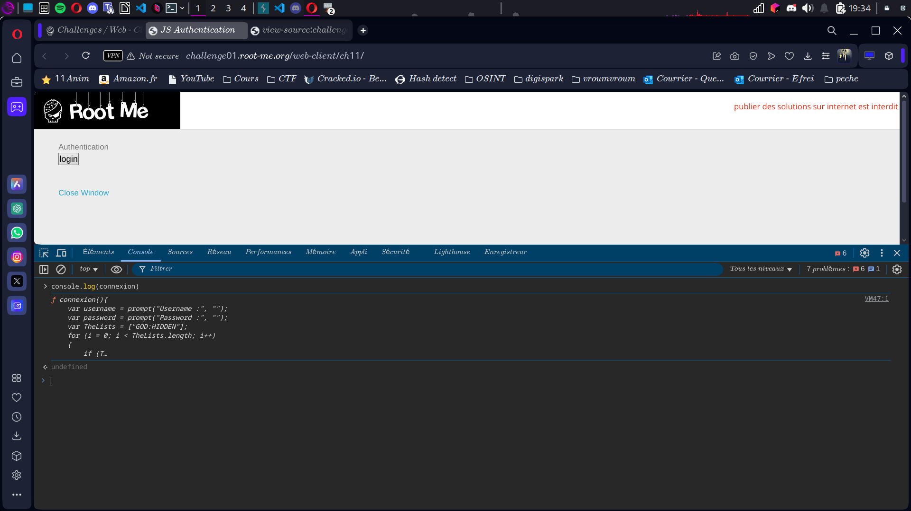

# Compte Rendu : CTF - Root Me Challenge

## **Challenge : Javascript - Authentification 2**  
- **Points :** 10  
- **Lien :** [*(Lien du challenge)*](http://challenge01.root-me.org/web-client/ch11/)

---

## **Objectif**  
Récupérer les informations d'authentification en utilisant la console JavaScript.

---

## **Étape 1 : Arrivée sur la page**  
- En arrivant sur la page, un formulaire d'authentification nous demande un nom d'utilisateur et un mot de passe.  
- **Screen associé :**   

---

## **Étape 2 : Utilisation de la console JavaScript**  
- Ouvrir la console JavaScript du navigateur (clic droit -> "Inspecter" -> "Console").  
- Taper la commande suivante dans la console :  
  ```javascript
  console.log(connexion)

## **Étape 3 : Lecture du code source JavaScript**  
- La commande `console.log(connexion)` affiche le code source de la fonction `connexion()`.  
- **Screen associé :**    

---

## **Lecture du code source**  
- Le code source de la fonction `connexion()` contient la déclaration des identifiants dans un tableau :  
  ```javascript
  var TheLists = ["GOD:HIDDEN"];

---

## **Étape 3 : Lecture du code source JavaScript**  
- En décomposant la chaîne, nous obtenons les informations suivantes :  
  - **Username :** `GOD`  
  - **Password :** `HIDDEN`  

---

## **Étape 4 : Connexion et récupération du flag**  
- Nous utilisons les informations d'identification découvertes (`GOD` pour le pseudo et `HIDDEN` pour le mot de passe) pour nous connecter.  
- Le flag apparaît lorsque la connexion est réussie.  
- **Flag affiché :**  
  ```text
  flag{GODHIDDEN}
## **Résultats**  
- **Vulnérabilité exploitée :** Exposition d'informations sensibles (username et password) dans le code JavaScript accessible via la console du navigateur.  

## Conclusion
Ce challenge met en lumière l'importance de ne pas exposer des informations sensibles dans le code JavaScript, car elles peuvent être récupérées facilement à travers la console du navigateur.