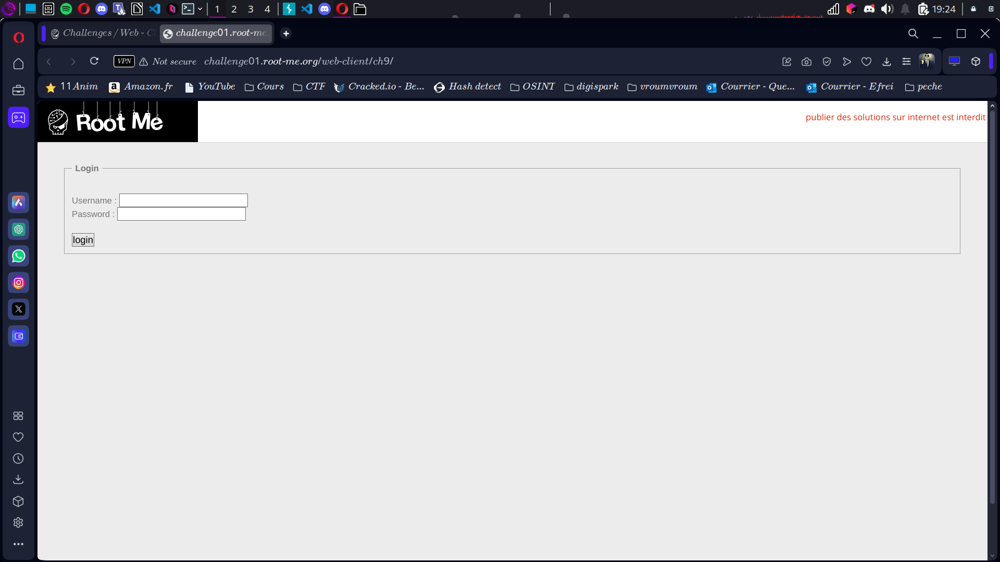
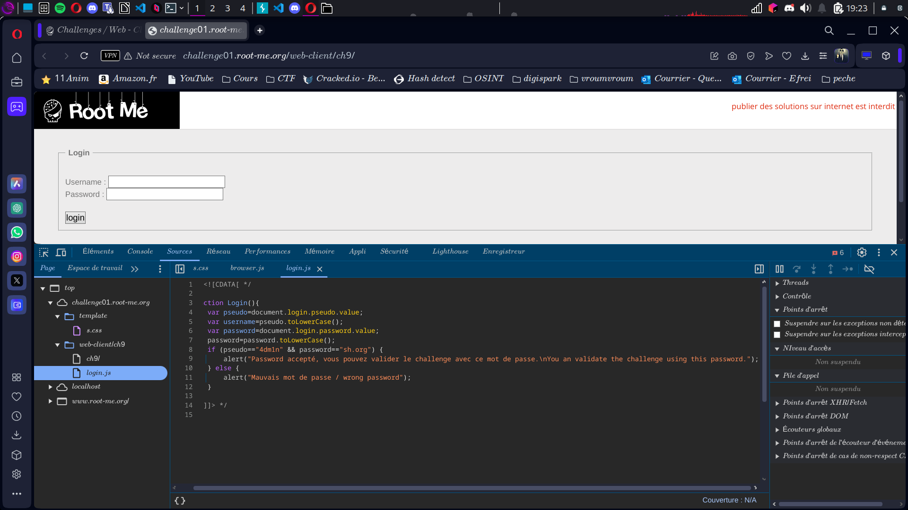
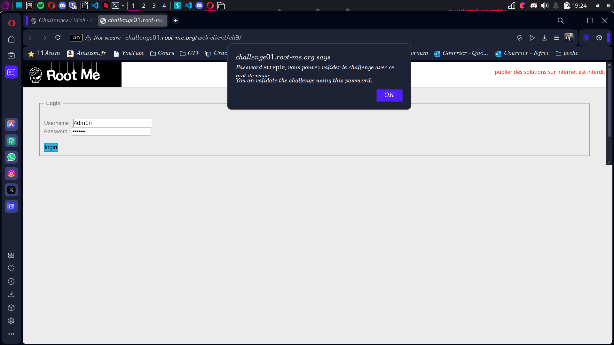

# Compte Rendu : CTF - Root Me Challenge

## **Challenge : Javascript - Authentification**  
- **Points :** 5  
- **Lien :** [http://challenge01.root-me.org/web-client/ch9/](http://challenge01.root-me.org/web-client/ch9/)

---

## **Objectif**  
Récupérer les informations d'authentification (login et mot de passe) pour valider le challenge.

---

## **Étape 1 : Arrivée sur la page**  
- La page contient un formulaire de connexion avec un champ pour le pseudo et un pour le mot de passe.  
- **Screen associé :**  

---

## **Étape 2 : Inspection de l'élément**  
- Nous faisons un clic droit et sélectionnons « Examiner l’élément », puis nous allons dans l'onglet « Débogueur ».  
- Nous déroulons le dossier "sources" et repérons le fichier `login.js`.  
- **Screen associé :**   

---

## **Étape 3 : Lecture du fichier `login.js`**  
- Nous ouvrons le fichier `login.js` et découvrons la fonction suivante :  
  ```
  if (pseudo=="4dm1n" && password=="sh.org") {
      alert("Password accepté, vous pouvez valider le challenge avec ce mot de passe.\nYou can validate the challenge using this password.");
  } else {
      alert("Mauvais mot de passe / wrong password");
  }
  ```

## **Observation**  
Le pseudo et le mot de passe sont directement définis dans le code :  
- **Pseudo :** `4dm1n`  
- **Mot de passe :** `sh.org`  

 

---

## **Étape 4 : Connexion et récupération du flag**  
- Nous utilisons les informations d'identification découvertes (`4dm1n` pour le pseudo et `sh.org` pour le mot de passe) pour nous connecter.  
- Le flag apparaît lorsque la connexion est réussie.  
- **Flag affiché :**  
```
flag{sh.org}
```

## **Résultats**  
- **Vulnérabilité exploitée :** Fuite d'informations sensibles dans le code JavaScript côté client.  

## **Conclusion**  
Ce challenge montre l'importance de ne pas stocker d'informations sensibles côté client, comme les identifiants, dans le code JavaScript, car cela peut facilement être exploré par l'attaquant avec les outils de développement du navigateur.

