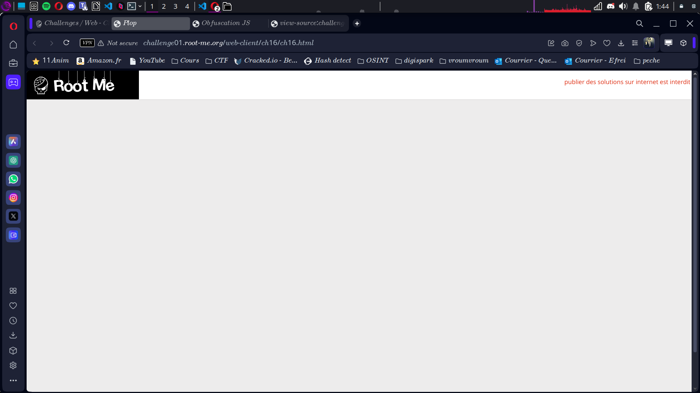
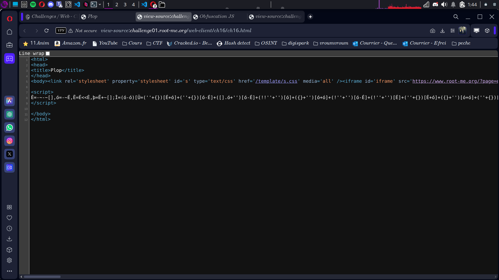

# Compte Rendu : CTF - Root Me Challenge

## **Challenge : Javascript - Native Code**  
- **Points :** 15  
- **Lien :** [http://challenge01.root-me.org/web-client/ch16/ch16.html](http://challenge01.root-me.org/web-client/ch16/ch16.html)  
 
---

## **Objectif**  
Trouver le mot de passe en clair dans le script JavaScript pour valider le challenge.

---

## **Étape 1 : Analyse initiale**  
- **Observation :** La page ne fournit aucun indice visuel.  
- **Action :** Utiliser l'outil de débogage Firebug de Firefox pour examiner le code JavaScript.  

---
 
## **Étape 2 : Exploration avec Firebug**  
1. Ouvrir Firebug et sélectionner l’onglet **"Script"** 
2. Lancez l'obfuscation
```
<script>
É=-~-~[],ó=-~É,Ë=É<<É,þ=Ë+~[];Ì=(ó-ó)[Û=(''+{})[É+ó]+(''+{})[ó-É]+([].ó+'')[ó-É]+(!!''+'')[ó]+({}+'')[ó+ó]+(!''+'')[ó-É]+(!''+'')[É]+(''+{})[É+ó]+({}+'')[ó+ó]+(''+{})[ó-É]+(!''+'')[ó-É]][Û];Ì(Ì((!''+'')[ó-É]+(!''+'')[ó]+(!''+'')[ó-ó]+(!''+'')[É]+((!''+''))[ó-É]+([].$+'')[ó-É]+'\''+''+'\\'+(ó-É)+(É+É)+(ó-É)+'\\'+(þ)+(É+ó)+'\\'+(ó-É)+(ó+ó)+(ó-ó)+'\\'+(ó-É)+(ó+ó)+(É)+'\\'+(ó-É)+(É+ó)+(þ)+'\\'+(ó-É)+(É+ó)+(É+ó)+'\\'+(ó-É)+(ó+ó)+(ó-ó)+'\\'+(ó-É)+(ó+ó)+(É+É)+'\\'+(É+ó)+(ó-ó)+'\\'+(É+É)+(þ)+'\\'+(ó-É)+(ó-ó)+(É+ó)+'\\'+(ó-É)+(É+ó)+(ó+ó)+'\\'+(ó-É)+(ó+ó)+(É+É)+'\\'+(ó-É)+(ó+ó)+(É)+'\\'+(ó-É)+(É+É)+(É+ó)+'\\'+(ó-É)+(þ)+(É)+'\\'+(É+É)+(ó-ó)+'\\'+(ó-É)+(É+ó)+(É+É)+'\\'+(ó-É)+(É+É)+(É+ó)+'\\'+(É+É)+(ó-ó)+'\\'+(ó-É)+(É+ó)+(É+ó)+'\\'+(ó-É)+(É+ó)+(þ)+'\\'+(ó-É)+(ó+ó)+(É+É)+'\\'+(É+É)+(ó-ó)+'\\'+(ó-É)+(É+É)+(É+É)+'\\'+(ó-É)+(É+É)+(É+ó)+'\\'+(É+É)+(ó-ó)+'\\'+(ó-É)+(ó+ó)+(ó-ó)+'\\'+(ó-É)+(É+É)+(ó-É)+'\\'+(ó-É)+(ó+ó)+(ó)+'\\'+(ó-É)+(ó+ó)+(ó)+'\\'+(ó-É)+(É+É)+(É+ó)+'\\'+(É+É)+(þ)+'\\'+(É+ó)+(ó-É)+'\\'+(þ)+(ó)+'\\'+(ó-É)+(É+ó)+(ó-É)+'\\'+(ó-É)+(É+É)+(ó+ó)+'\\'+(É+ó)+(ó-ó)+'\\'+(ó-É)+(É+É)+(ó-É)+'\\'+(þ)+(É+ó)+'\\'+(þ)+(É+ó)+'\\'+(É+É)+(þ)+'\\'+(ó-É)+(ó+ó)+(É+É)+'\\'+(ó-É)+(É+ó)+(þ)+'\\'+(ó-É)+(ó+ó)+(É+É)+'\\'+(ó-É)+(É+ó)+(þ)+'\\'+(ó+ó)+(ó-É)+'\\'+(ó+ó)+(É)+'\\'+(ó+ó)+(ó)+'\\'+(ó-É)+(É+ó)+(É+É)+'\\'+(ó-É)+(É+ó)+(þ)+'\\'+(ó-É)+(É+ó)+(É+É)+'\\'+(É+É)+(þ)+'\\'+(É+ó)+(ó-É)+'\\'+(ó-É)+(þ)+(ó)+'\\'+(ó-É)+(É+É)+(ó-É)+'\\'+(ó-É)+(É+ó)+(É+É)+'\\'+(ó-É)+(É+É)+(É+ó)+'\\'+(ó-É)+(ó+ó)+(É)+'\\'+(ó-É)+(ó+ó)+(É+É)+'\\'+(É+ó)+(ó-ó)+'\\'+(É+É)+(þ)+'\\'+(ó-É)+(É+É)+(É)+'\\'+(ó-É)+(ó+ó)+(É)+'\\'+(ó-É)+(É+É)+(ó-É)+'\\'+(ó-É)+(ó+ó)+(ó+ó)+'\\'+(ó-É)+(É+ó)+(þ)+'\\'+(É+É)+(þ)+'\\'+(É+ó)+(ó-É)+'\\'+(þ)+(ó)+'\\'+(ó-É)+(þ)+(É+ó)+'\\'+(ó-É)+(É+É)+(É+ó)+'\\'+(ó-É)+(É+ó)+(É+É)+'\\'+(ó-É)+(ó+ó)+(ó)+'\\'+(ó-É)+(É+É)+(É+ó)+'\\'+(ó-É)+(þ)+(ó)+'\\'+(ó-É)+(É+É)+(ó-É)+'\\'+(ó-É)+(É+ó)+(É+É)+'\\'+(ó-É)+(É+É)+(É+ó)+'\\'+(ó-É)+(ó+ó)+(É)+'\\'+(ó-É)+(ó+ó)+(É+É)+'\\'+(É+ó)+(ó-ó)+'\\'+(É+É)+(þ)+'\\'+(ó-É)+(É+É)+(ó+ó)+'\\'+(ó-É)+(É+É)+(ó-É)+'\\'+(ó-É)+(É+ó)+(ó-É)+'\\'+(ó-É)+(É+ó)+(É+É)+'\\'+(É+ó)+(ó+ó)+'\\'+(É+ó)+(ó+ó)+'\\'+(É+ó)+(ó+ó)+'\\'+(É+É)+(þ)+'\\'+(É+ó)+(ó-É)+'\\'+(þ)+(ó)+'\\'+(ó-É)+(þ)+(É+ó)+'\'')())()
</script>
```
3. Dans la liste des scripts, sélectionner : **"ch16.html line 8 > Function (1)"**.  
4. Le code suivant apparaît avec le mot de passe directement en clair :  

```
a=prompt('Entrez le mot de passe'); if(a=='[FLAG CACHÉ]'){ alert('bravo'); } else { alert('fail...'); }
```

---

## **Étape 3 : Validation**  
- **Mot de passe obtenu :**  
```
[FLAG CACHÉ]
```
- **Action :** Entrer ce mot de passe dans la boîte de dialogue.  
- **Résultat :** Un message de validation s'affiche avec l'alerte **"bravo"**.  

---

## **Conclusion**  
Ce challenge illustre que, sans mécanisme de sécurité supplémentaire, le code JavaScript côté client peut révéler des informations sensibles comme des mots de passe. Les outils de débogage permettent une analyse directe des scripts pour contourner de telles protections.
