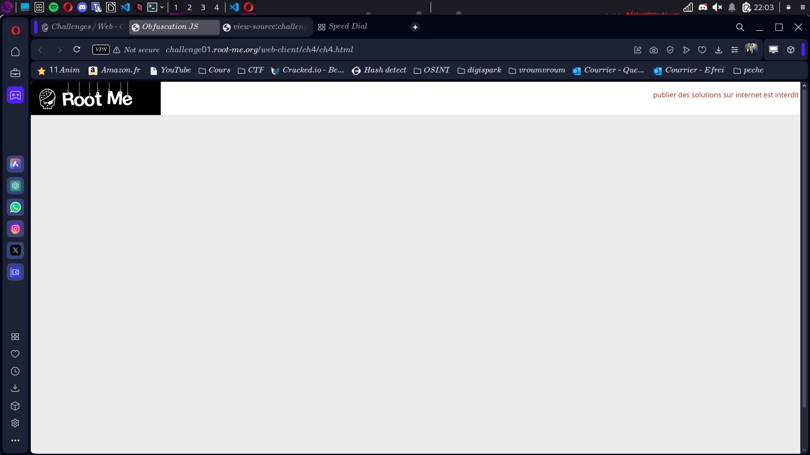
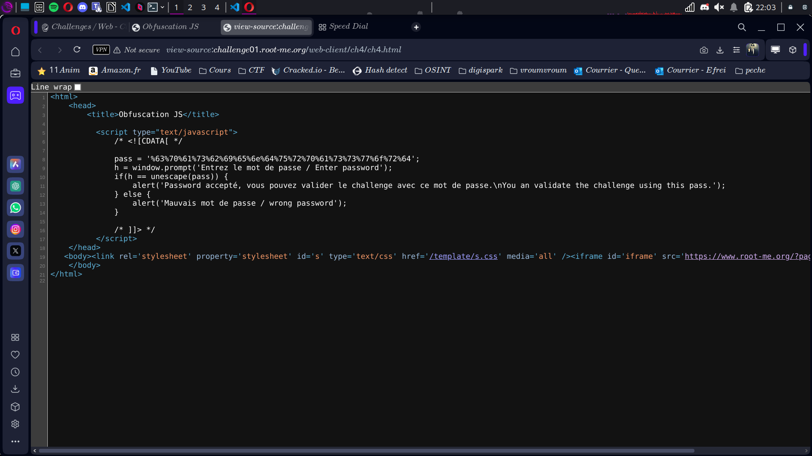

# Compte Rendu : CTF - Root Me Challenge

## **Challenge : Javascript - Obfuscation 1**  
- **Points :** 10  
- **Lien :** [http://challenge01.root-me.org/web-client/ch4/ch4.html](http://challenge01.root-me.org/web-client/ch4/ch4.html)  

---
 
## **Objectif**  
Déchiffrer une chaîne de caractères obfusquée pour obtenir le flag ou le mot de passe.

---

## **Étape 1 : Analyse de la page**  
- La page contient une chaîne de caractères obfusquée en HEX :  

```
[FLAG CACHÉ]
```
- **Screen associé :**   

---

## **Étape 2 : Déchiffrement**  
- **Action :** Copier la chaîne HEX et utiliser un convertisseur en ligne HEX vers ASCII.  
- **Résultat :** La chaîne traduite donne :  
cpasbiendurpassword

---

## **Étape 3 : Utilisation du mot de passe**  
- Une fois la chaîne déchiffrée, elle peut être utilisée comme mot de passe ou flag.  

---

## **Résultats**  
- **Vulnérabilité exploitée :** Obfuscation faible basée sur une conversion HEX.  

---

## **Conclusion**  
Ce challenge illustre que des méthodes d'obfuscation simples, comme l'encodage en HEX, ne protègent pas efficacement les données. Elles peuvent être facilement contournées à l'aide d'outils de conversion en ligne.
