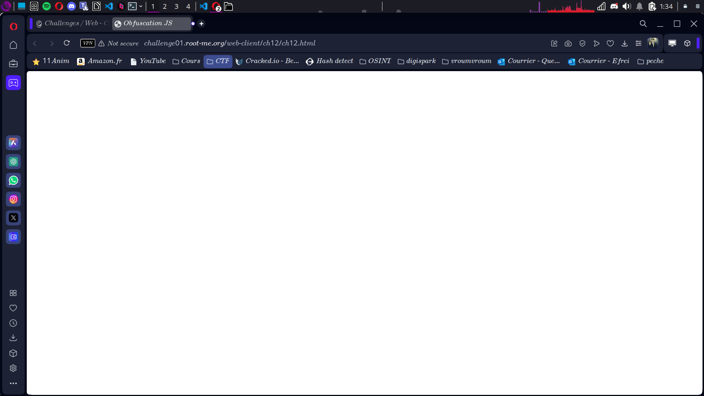
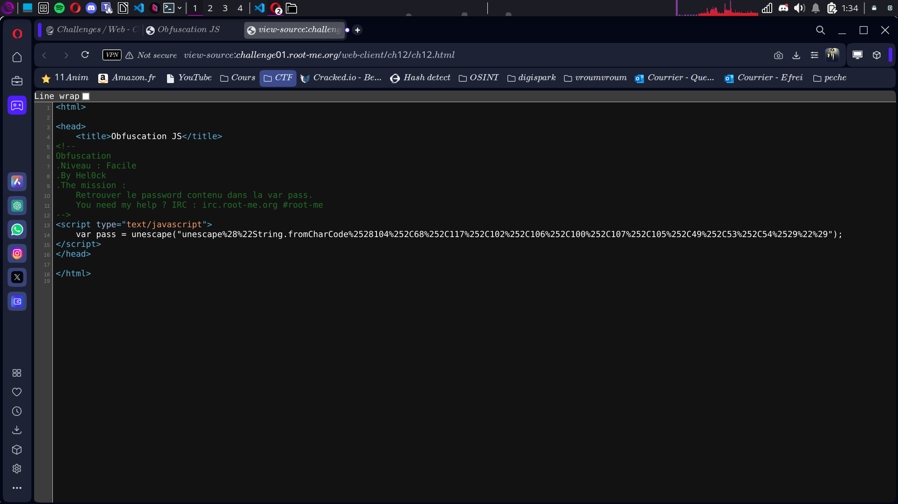

# Compte Rendu : CTF - Root Me Challenge

## **Challenge : Javascript - Obfuscation 2**  
- **Points :** 10  
- **Lien :** [http://challenge01.root-me.org/web-client/ch12/ch12.html](http://challenge01.root-me.org/web-client/ch12/ch12.html)  

---
 

## **Objectif**  
Déchiffrer un mot de passe encodé avec plusieurs niveaux d'obfuscation en JavaScript.

---

## **Étape 1 : Analyse initiale**  
- **Observation :** La page est blanche.  
- **Action :** Afficher le code source avec `Ctrl + U`.  
- **Résultat :** On découvre un script contenant le mot de passe obfusqué :  
 
```
<script type="text/javascript"> var pass = unescape("unescape%28%22String.fromCharCode%2528104%252C68%252C117%252C102%252C106%252C100%252C107%252C105%252C49%252C53%252C54%2529%22%29"); </script>
```


---

## **Étape 2 : Déchiffrement par étapes**  

### **Premier étage : Application de `unescape()`**  
- **Action :** Décoder la chaîne avec `unescape()`.  
- **Résultat :**  

```
var pass = unescape("unescape("String.fromCharCode%28104%2C68%2C117%2C102%2C106%2C100%2C107%2C105%2C49%2C53%2C54%29")");
```


### **Deuxième étage : Application de `unescape()` une seconde fois**  
- **Action :** Décoder à nouveau avec `unescape()`.  
- **Résultat :**  
```
var pass = unescape("unescape("String.fromCharCode(104,68,117,102,106,100,107,105,49,53,54)")");
```

### **Troisième étage : Conversion des valeurs ASCII en caractères**  
- **Action :** Décoder les valeurs ASCII.  
- **Valeurs ASCII :**  
```
104, 68, 117, 102, 106, 100, 107, 105, 49, 53, 54
```
- **Résultat :** Le mot de passe en clair.  

## **Étape 3 : Validation**  
- **Mot de passe obtenu :**  
```
hDufjdki156
```

---

## **Documentation utile**  
- Table ASCII complète : [ASCII Table](http://www.asciitable.com/index/asciifull.gif)  
- Fonction `unescape()` : [MDN Documentation](https://developer.mozilla.org/fr/docs/JavaScript_Guide/Fonctions_pr%C3%A9d%C3%A9finies/Les_fonctions_escape_et_unescape)  
- Outil pour décoder : [Unescape Tool](http://www.tareeinternet.com/scripts/unescape.html)  

---

## **Conclusion**  
Ce challenge montre comment plusieurs couches d'obfuscation peuvent être utilisées pour protéger une chaîne de caractères. Cependant, ces couches peuvent être facilement contournées avec les bons outils et une compréhension des fonctions JavaScript.
    