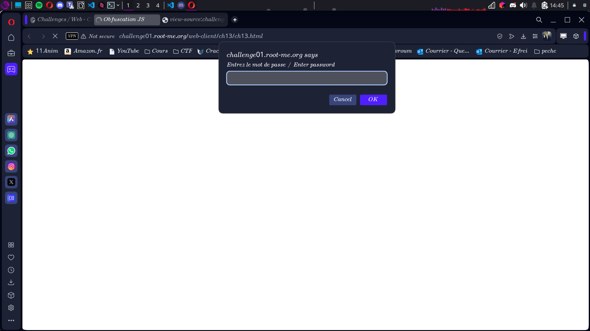
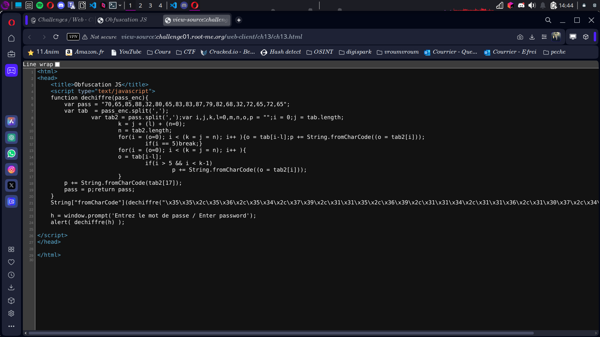

# **Compte Rendu : CTF - Root Me Challenge**

## **Challenge : Javascript - Obfuscation 3**  
- **Points :** 30  
- **Lien :** [http://challenge01.root-me.org/web-client/ch13/ch13.html](http://challenge01.root-me.org/web-client/ch13/ch13.html)  

---
 
## **Énoncé**  
Utile ou inutile, telle est la question...  
Spoiler : On va prouver que même du code bizarre peut cacher des trésors 🏆.

---

## **Étape 1 : Analyse des sources**  
En descendant (pas trop vite, hein) dans le fichier source de la page, on tombe sur une suite de caractères qui ressemble à des hiéroglyphes modernes :  
 
```
\x35\x35\x2c\x35\x36\x2c\x35\x34\x2c\x37\x39\x2c\x31\x31\x35\x2c\x36\x39\x2c\x31\x31\x34\x2c\x31\x31\x36\x2c\x31\x30\x37\x2c\x34\x39\x2c\x35\x30
```
Bon, ça ne parle pas tout de suite, mais c’est là que la magie de Javascript intervient. ✨

---

## **Étape 2 : Décryptage niveau 1 - Les chiffres**  
1. **Action :** Ouvrir la console (F12 > Onglet Console).  
2. **Commande à taper :**  
```
   alert('\x35\x35\x2c\x35\x36\x2c\x35\x34\x2c\x37\x39\x2c\x31\x31\x35\x2c\x36\x39\x2c\x31\x31\x34\x2c\x31\x31\x36\x2c\x31\x30\x37\x2c\x34\x39\x2c\x35\x30')
```

### **Résultat : Une pop-up apparaît avec une liste de chiffres :
```
55,56,54,79,115,69,114,116,107,49,50
```
On avance dans notre quête du Graal. ⚔️

## **Étape 3 : Décryptage niveau 2 - Le trésor dévoilé**  
1. **Action :** Toujours dans la console, entrez la commande suivante :  
```
   alert(String.fromCharCode(55,56,54,79,115,69,114,116,107,49,50))
```
### **Résultat : Le mot de passe enfin révélé**  
Une pop-up surgit, dévoilant le **mot de passe magique** tant attendu :  
🏅 **Mot de passe :** `786Osertk12`

---

### **Conclusion : Une victoire éclatante**  
Grâce à un soupçon de curiosité et deux incantations Javascript mythiques (`alert` et `String.fromCharCode`), la suite obscure se transforme en un trésor clair et éclatant.  

Challenge triomphalement validé, le Graal en poche, et une nouvelle victoire contre les mystères du développeur ! ✨🏆🎊

