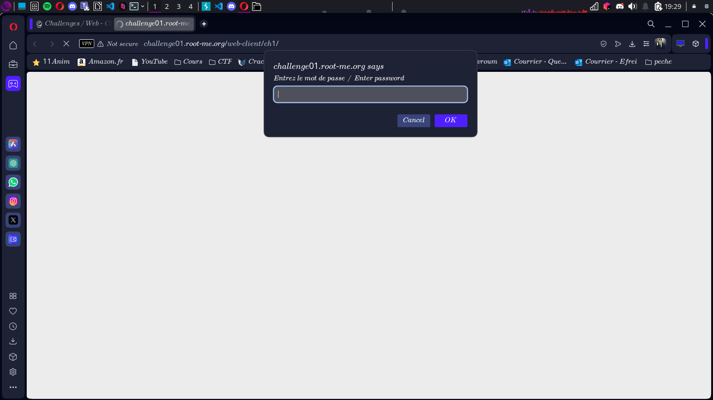
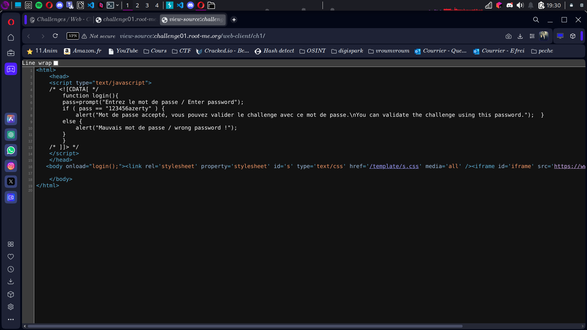

# Compte Rendu : CTF - Root Me Challenge

## **Challenge : Javascript - Source**  
- **Points :** 5  
- **Lien :** [http://challenge01.root-me.org/web-client/ch1/](http://challenge01.root-me.org/web-client/ch1/)

---

## **Objectif**  
Trouver le mot de passe en analysant le code source HTML de la page.

---

## **Étape 1 : Arrivée sur la page**  
- La page contient un script JavaScript dont le code est visible dans le source de la page.  
- **Screen associé :**  


---

## **Étape 2 : Inspection du code source**  
- En inspectant le code source de la page, nous découvrons un script JavaScript entre les balises `<script>` et `</script>`.  
- Le mot de passe est affiché en clair dans ce script.  
- **Screen associé :**  
 

## **Étape 3 : Récupération du mot de passe**  
- Le mot de passe est directement visible dans le code source.  
- **Mot de passe récupéré :**  
```
flag{123456azerty}
```

## **Résultats**  
- **Vulnérabilité exploitée :** Fuite d'informations sensibles dans le code source de la page (mot de passe en clair).  

## **Conclusion**  
Ce challenge illustre la vulnérabilité de la mise en ligne d'informations sensibles, comme un mot de passe, directement dans le code source HTML de la page, ce qui peut être facilement récupéré par un attaquant.
