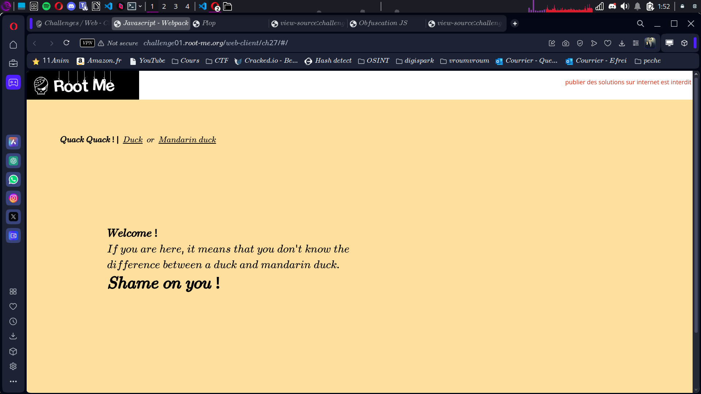

# Compte Rendu : CTF - Root Me Challenge

## **Challenge : Javascript - Webpack**  
- **Points :** 15  
- **Lien :** [http://challenge01.root-me.org/web-client/ch27/#/](http://challenge01.root-me.org/web-client/ch27/#/)  

---

## **Objectif**  
Exploiter les sources accessibles via Webpack pour trouver le flag.

---

## **Étape 1 : Analyse des sources**  
- **Action :** Utiliser les outils de développement (Ctrl+Shift+I) pour inspecter les sources.  
- **Observation :** L'application utilise Webpack pour packager ses sources. Les fichiers **source map** n'ont pas été désactivés lors de la mise en production.  
 
---

## **Étape 2 : Exploration des sources Webpack**  
1. Naviguer vers **webpack:///** dans l'inspecteur de sources.  
2. Identifier un fichier intéressant nommé :  
```
webpack:///src/components/YouWillNotFoundThisRouteBecauseItIsHidden.vue
```
3. Lire le contenu du fichier.  

---

## **Étape 3 : Découverte du flag**  
Dans le fichier, un commentaire du développeur révèle le flag :  
```
// Did you know that comments are readable by the end user ? 
// Well, this because I build the application with the source maps enabled !!! 
// So please, disable source map when you build for production 
// Here is your flag : Flag{Webpack_Exposed_Flag}
```

---

## **Conclusion**  
Ce challenge démontre l'importance de désactiver les fichiers source map en production pour éviter d'exposer des informations sensibles dans les commentaires ou le code non minifié.
