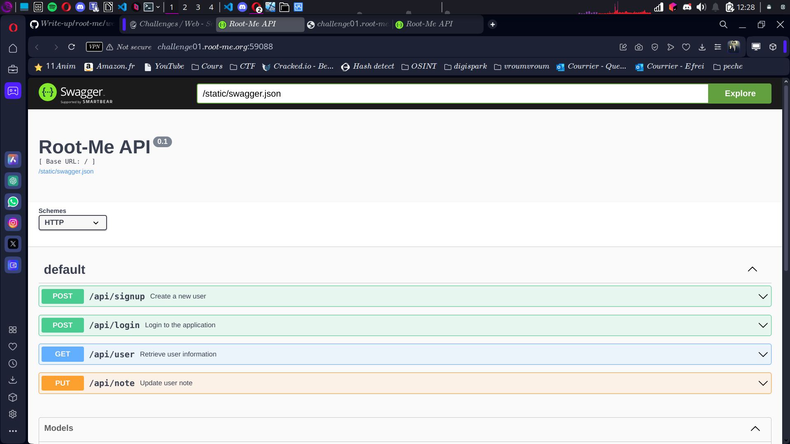
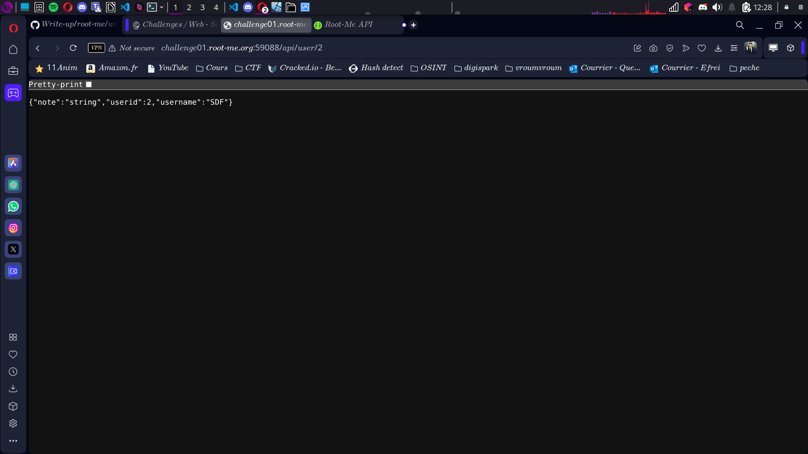
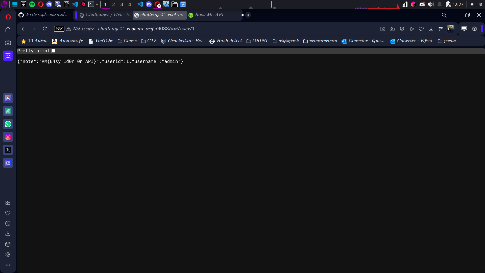

# Compte Rendu : CTF - Root Me Challenge

## **Challenge : API - Broken Access**  
- **Points :** 15  
- **Lien :**  
  [http://challenge01.root-me.org:59088/#/](http://challenge01.root-me.org:59088/#/)  

---

## **Objectif**  
L'objectif est de tester une API pour trouver une faille de type **Broken Access Control**, qui permettrait de manipuler des `user_id` dans l'URL afin d'accéder à des informations sensibles d'autres utilisateurs, y compris l'administrateur.

---

## **Étape 1 : Arrivée sur la page de création de l'API (Swagger)**  
- Vous arrivez sur une page Swagger où vous pouvez interagir avec l'API et créer des profils.  
- **Observation :** Vous pouvez créer un profil et ajouter une note privée.  
- **Objectif :** Vérifier si la gestion des ID utilisateur présente des failles de sécurité.
- **Screen associé :**  

---

## **Étape 2 : Recherche sur "Broken Access"**  
- **Broken Access Control** : Ce type de faille survient lorsque les utilisateurs peuvent manipuler des identifiants (tels que les `user_id`) dans l'URL pour accéder à des ressources protégées.  
- Dans ce challenge, l'URL contient un `user_id` qui peut être modifié, ce qui peut permettre l'accès aux profils d'autres utilisateurs.

---

## **Étape 3 : Création d'un profil et mise en place d'une note**  
- Vous créez un profil avec un `user_id` généré automatiquement et ajoutez une note privée à ce profil.  
- Vous obtenez une URL de profil qui ressemble à ceci :  

[http://challenge01.root-me.org:59088/#/default/api/user/2](http://challenge01.root-me.org:59088/#/default/api/user/2)

- Le `2` dans l'URL correspond à votre propre `user_id`.
- **Screen associé :**  

---

## **Étape 4 : Exploit de la faille - Modification du lien**  
- Vous modifiez l'URL pour tenter d'accéder au profil de l'administrateur en remplaçant le `2` par `1` (qui pourrait être l'ID de l'admin) :  

[http://challenge01.root-me.org:59088/#/default/api/user/1](http://challenge01.root-me.org:59088/#/default/api/user/1)

- **Screen associé :**  
- Vous obtenez l'accès au profil de l'administrateur et trouvez le flag dans la note.

---

## **Résultats**  
- **Vulnérabilité exploitée :** Broken Access Control (manipulation du `user_id`).  
- **Flag obtenu :**  RM{E4sy_1d0r_0n_API}

