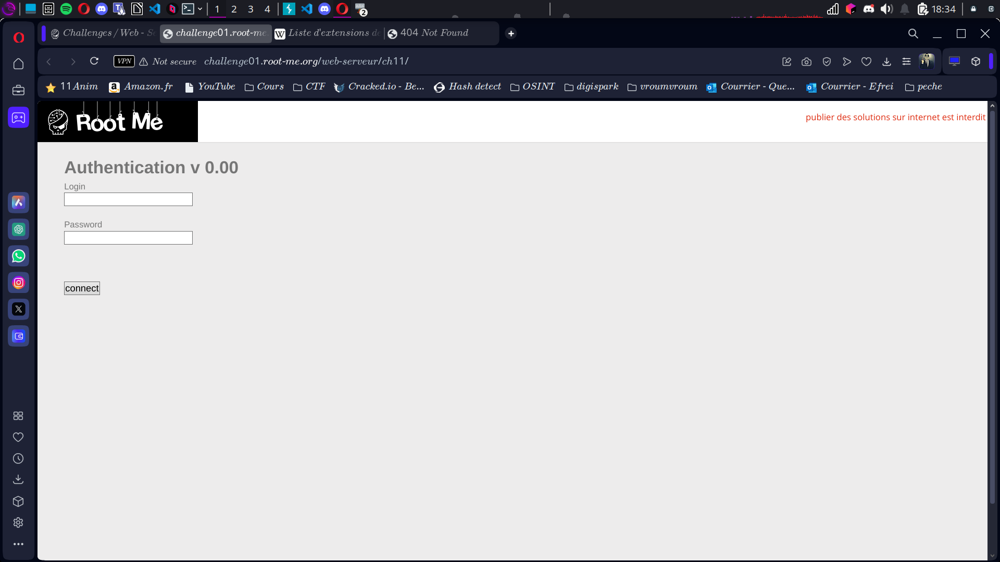
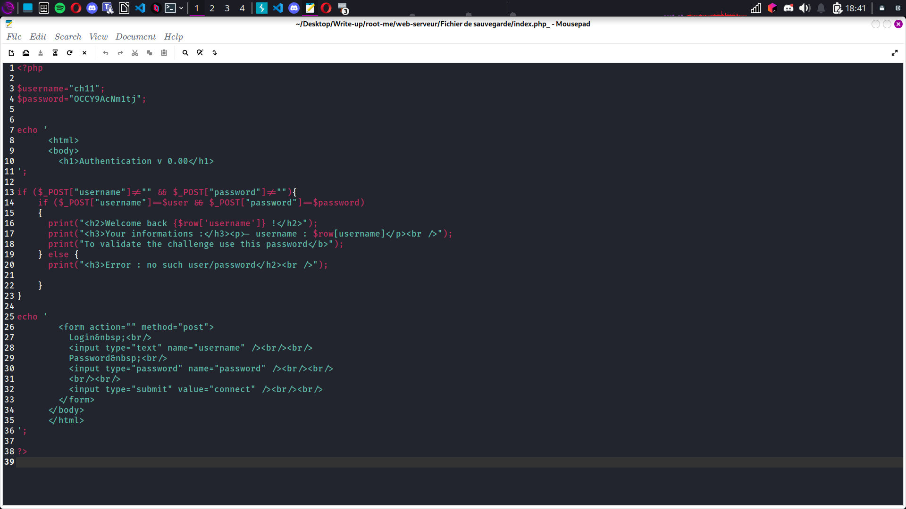

# Compte Rendu : CTF - Root Me Challenge

## **Challenge : Fichier de Sauvegarde**  
- **Points :** 15  
- **Lien :**  
  [http://challenge01.root-me.org/web-serveur/ch11/](http://challenge01.root-me.org/web-serveur/ch11/)

---

## **Objectif**  
Explorer les fichiers générés automatiquement et trouver un fichier de sauvegarde caché qui contient le flag.

---

## **Étape 1 : Arrivée sur la page**  
- La page contient uniquement un formulaire avec les champs "username" et "password". Aucun indice ou indication supplémentaire n'est fourni.  
- **Observation :** Aucune injection XSS, SQL ou OS ne fonctionne. Nous devons trouver une autre méthode.  
- **Screen associé :**    

---

## **Étape 2 : Recherche d'un fichier de sauvegarde**  
- Nous observons que la page utilise `index.php` comme fichier principal.  
- **Hypothèse :** Il pourrait y avoir un fichier de sauvegarde caché généré automatiquement derrière ce fichier.  
- Nous essayons d'ajouter des suffixes courants tels que `.tar` et `.cpio`, mais cela ne fonctionne pas.  
- Finalement, nous essayons le caractère spécial `~`, qui est souvent associé à des fichiers temporaires ou de sauvegarde dans les systèmes Unix/Linux.  
- **URL modifiée :**  

[http://challenge01.root-me.org/web-serveur/ch11/index.php~](http://challenge01.root-me.org/web-serveur/ch11/index.php~) 

---

## **Étape 3 : Accès au fichier de sauvegarde**  
- En accédant à l'URL modifiée, nous obtenons un fichier caché qui contient le flag.  

- **Screen associé :**  
```
flag{[FLAG CACHÉ]}
```
## **Conclusion**  
Ce challenge met en évidence l'importance de sécuriser les fichiers générés automatiquement, notamment ceux associés aux versions précédentes ou aux sauvegardes. Ces fichiers peuvent contenir des informations sensibles ou permettre d'obtenir un accès non autorisé si l'URL est manipulée correctement. 

Le **Saint Graal** de ce challenge était un simple fichier de sauvegarde généré automatiquement et accessible via le caractère `~`.
