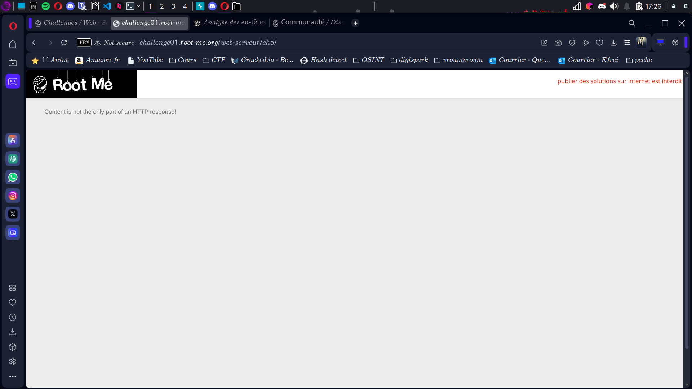
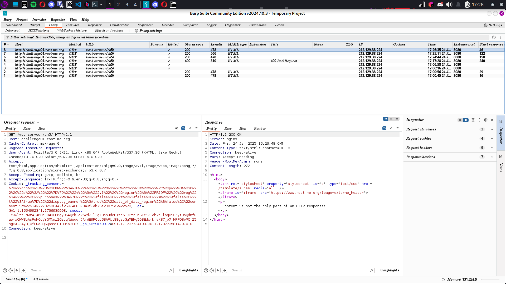
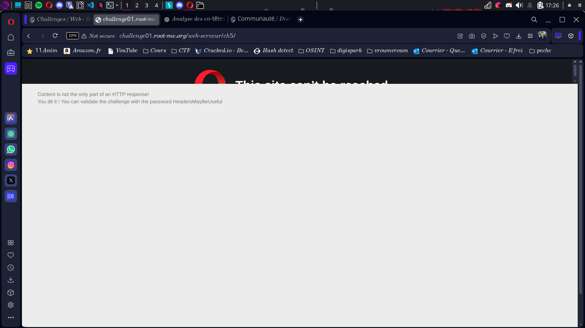

# Compte Rendu : CTF - Root Me Challenge

## **Challenge : HTTP - Headers**  
- **Points :** 15  
- **Lien :**  
  [http://challenge01.root-me.org/web-serveur/ch5/](http://challenge01.root-me.org/web-serveur/ch5/)

---

## **Objectif**  
Obtenez l'accès administrateur à la page en manipulant les en-têtes HTTP d'une réponse.

---

## **Étape 1 : Arrivée sur la page**  
- La page affiche le message :  
  **"Content is not the only part of an HTTP response!"**  
  Cela nous indique que le contenu ne suffit pas pour résoudre le challenge. Nous devons analyser les en-têtes HTTP pour trouver la faille de sécurité.  
- **Screen associé :**   

---

## **Étape 2 : Analyse avec Burp Suite**  
- Ouvrez Burp Suite pour intercepter les réponses HTTP.  

- **Observation clé :** Vous remarquez l'en-tête `Connection: close`, ce qui signifie que la connexion sera fermée après la réponse. Cependant, ce n'est pas l'indice recherché.  
- **Screen associé :** *  

---

## **Étape 3 : Modification de l'en-tête `Connection`**  
- Vous supprimez l'argument `keep` dans l'en-tête `Connection` et laissez simplement `alive`.  
- **Nouvelle réponse :** Vous remarquez l'ajout d'un nouvel en-tête :  
```
Header-RootMe-Admin: none
```

Cela vous indique qu'il existe un en-tête qui contrôle l'accès administrateur.  

---

## **Étape 4 : Modification de l'en-tête pour l'accès admin**  
- Vous modifiez l'en-tête `Header-RootMe-Admin` pour y mettre la valeur `admin`.  
- Une fois la requête envoyée, le flag apparaît :  
```
flag{HeadersMayBeUseful}
```

- **Screen associé :**   

---

## **Résultats**  
- **Vulnérabilité exploitée :** Manipulation des en-têtes HTTP pour obtenir un accès administrateur.  


