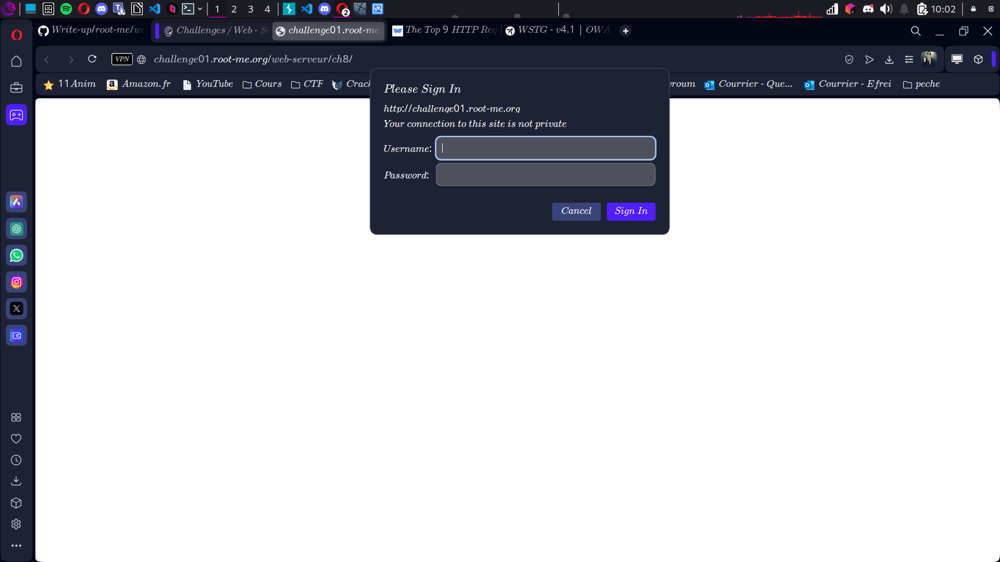
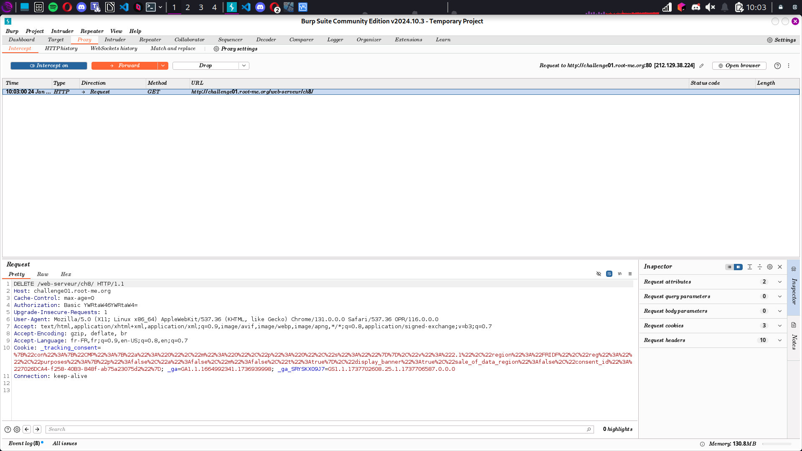
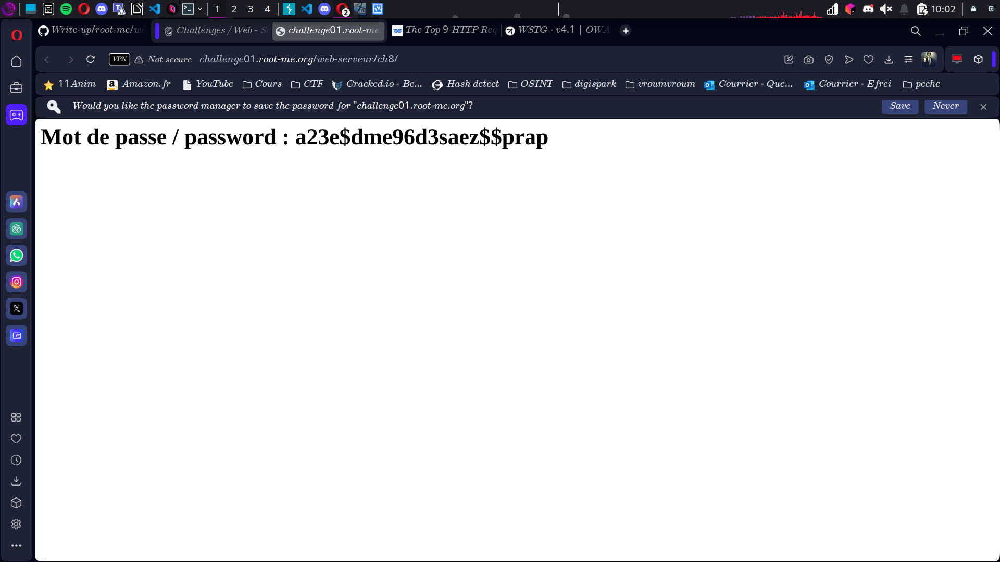

# Compte Rendu : CTF - Root Me Challenge

## **Challenge : HTTP - Verb Tampering**  
- **Points :** 15  
- **Lien :**  
  [http://challenge01.root-me.org/web-serveur/ch8/](http://challenge01.root-me.org/web-serveur/ch8/)  

---

## **Objectif**  
Exploiter une vulnérabilité basée sur la manipulation des verbes HTTP pour contourner une authentification et obtenir le flag.

---

## **Étape 1 : Arrivée sur la page**  
- **Observation :** Une fenêtre de type "pop-up" d'authentification HTTP apparaît, demandant un **username** et un **mot de passe**.  
- **Action :** Faire des recherches sur la technique appelée **verb tampering**, qui consiste à exploiter certains verbes HTTP pour contourner des mécanismes de sécurité.  
- **Screen associé :**  

---

## **Étape 2 : Recherche sur les verbes HTTP**  

Les verbes HTTP possibles incluent :  

- **OPTIONS :** Permet de demander au serveur quelles méthodes HTTP sont disponibles pour une ressource donnée.  

- **GET :** Récupère les données d'une ressource spécifique. Le verbe le plus utilisé pour consulter une page web.  

- **HEAD :** Similaire à GET, mais il ne récupère que les en-têtes HTTP et pas le contenu. 

- **POST :** Envoie des données au serveur (souvent utilisées pour soumettre des formulaires).  

- **PUT :** Charge ou remplace une ressource sur le serveur.  

- **DELETE :** Supprime une ressource spécifique sur le serveur.  

- **TRACE :** Effectue une boucle de test pour vérifier les modifications apportées à une requête entre le client et le serveur.  

- **CONNECT :** Utilisé pour établir un tunnel vers un serveur via un proxy (souvent utilisé pour HTTPS).  

- **Hypothèse :** Modifier le verbe HTTP utilisé dans la requête pourrait permettre d'accéder à la ressource sans passer par l'authentification.  

---

## **Étape 3 : Modification de la requête via Burp Suite**  

1. **Action :** Intercepter la requête HTTP originale avec Burp Suite.  
   - **Requête interceptée :**  
     ```http
     GET /web-serveur/ch8/ HTTP/1.1  
     Host: challenge01.root-me.org  
     ```  
   - **Screen associé :** *(Insérer un screen de la requête interceptée dans Burp Suite)*  

2. **Action :** Modifier le verbe `GET` par `DELETE`.  
   - **Requête modifiée :**  
     ```http
     DELETE /web-serveur/ch8/ HTTP/1.1  
     Host: challenge01.root-me.org  
     ```  
   - **Screen associé :**   

3. **Résultat :** La pop-up d'authentification disparaît, et la page affiche directement le flag.  

---

## **Étape 4 : Récupération du flag**  
- **Flag affiché :**  
Flag{a23e$dme96d3saez$$prap}

- **Screen associé :**  

---

## **Résultats**  
- **Vulnérabilité exploitée :** Manipulation du verbe HTTP (**verb tampering**).  
