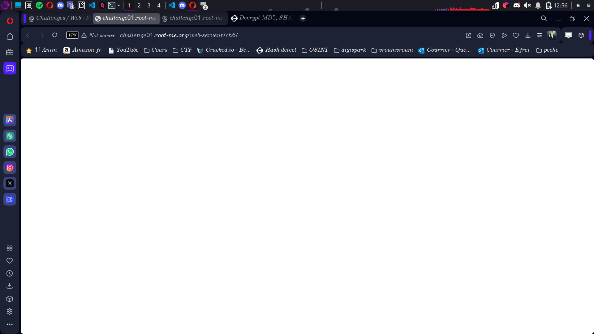
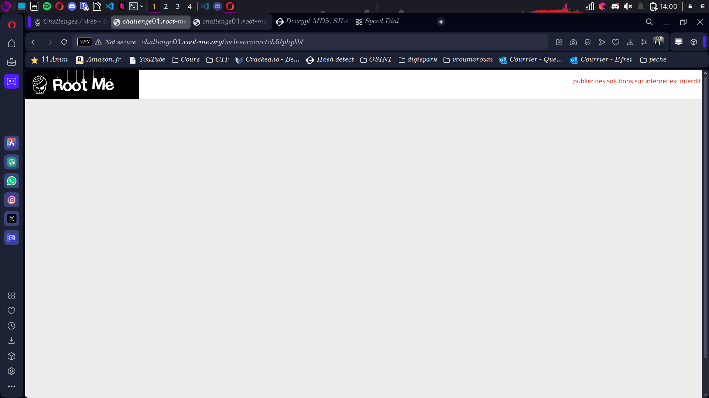
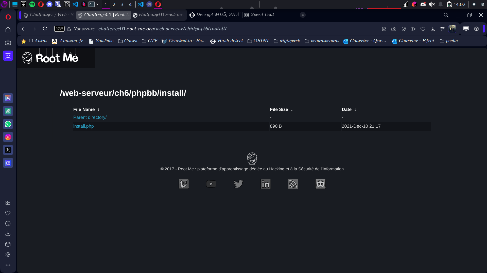

## Compte Rendu : CTF - Root Me Challenge
#### Objectif
Trouver le flag et le mot de passe à partir d'un challenge basé sur PHP et PHPBB.

Lien initial :

```
http://challenge01.root-me.org/web-serveur/ch6/  
```
 
#### Étape 1 : Analyse de la consigne
Observation : la consigne mentionne "PHPBB", un système de forum écrit en PHP. Recherche rapide pour comprendre le concept.
Screen associé : (Insérer un screen de la consigne ou de la recherche sur PHPBB)

#### Étape 2 : Ajout du répertoire phpbb
Lien testé :
```
http://challenge01.root-me.org/web-serveur/ch6/phpbb  
```
Résultat : arrivée sur une page confirmant la présence d'une structure PHP.
 

#### Étape 3 : Ajout de l'extension /install

Lien testé :
```
http://challenge01.root-me.org/web-serveur/ch6/phpbb/install  
```
Résultat : arrivée sur une page listant des fichiers, notamment install.php.
 

#### Étape 4 : Exploration de install.php

Action : ouverture du fichier install.php.
Résultat : le flag est visible dans la page.


#### Résultats
Flag trouvé : (Screen joint du flag)
Mot de passe : [FLAG CACHÉ]

#### Conclusion
Le challenge a été résolu en utilisant une approche méthodique basée sur les indices de la consigne et des tests successifs d'extensions de liens.

