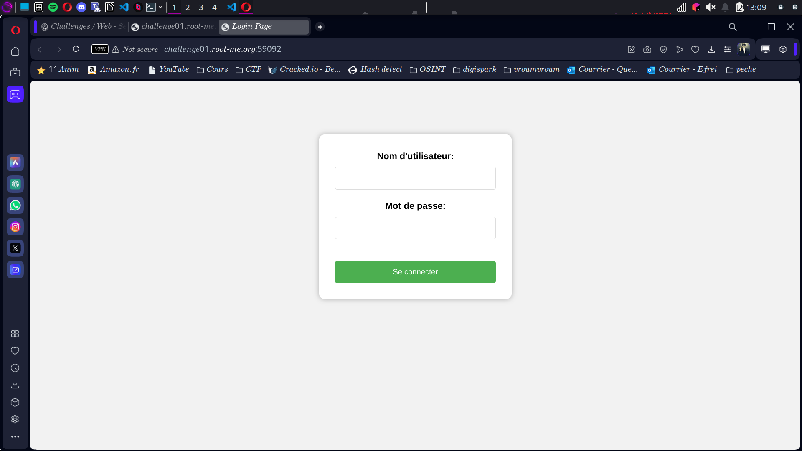
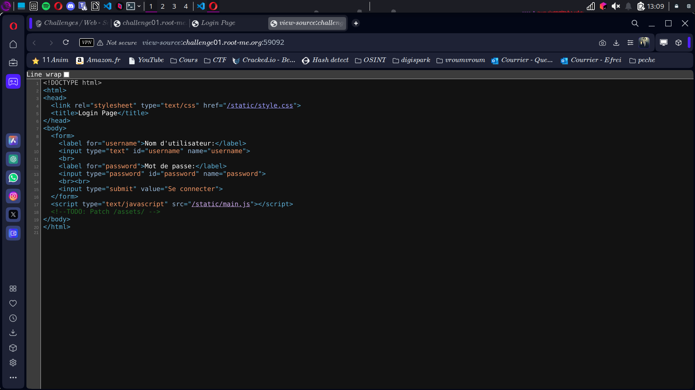
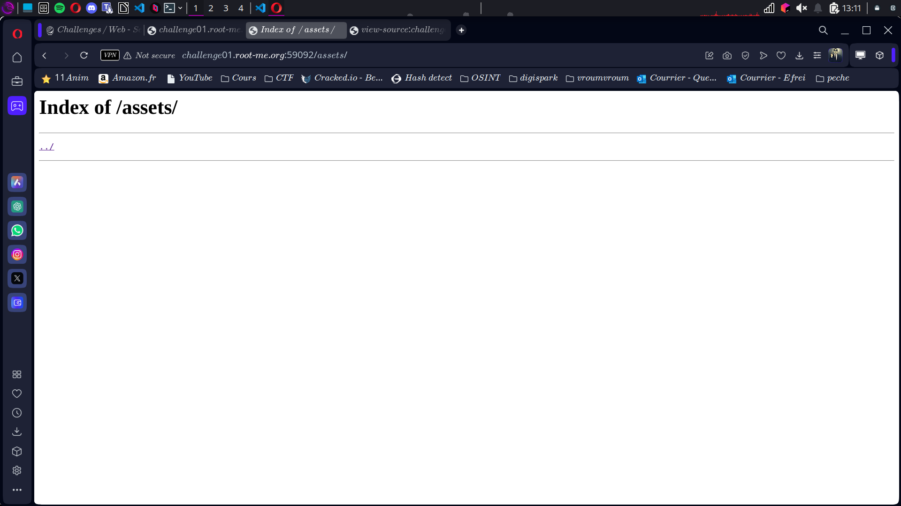
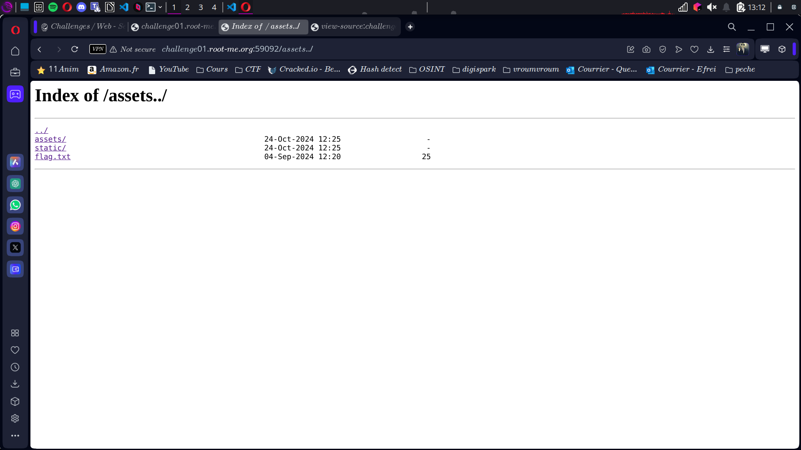

# Rapport - Nginx Alias Misconfiguration 🐒

**Challenge** : Nginx - Alias Misconfiguration  
**Points** : 15  
**Nom de l'épreuve** : Off By Slash  
**URL** : [http://challenge01.root-me.org:59092](http://challenge01.root-me.org:59092)

---

## Énoncé  
Un développeur web de notre entreprise a finalisé le nouvel intranet.  
**Mission** : Évaluer la sécurité de ce site avant sa mise en production.  

---

## Analyse et exploitation  

### 1. Arrivée sur la page de login  
On commence en douceur, page de login classique.  
On tente une connexion... et BAM 💥, impossible d'envoyer le formulaire, ça a été bloqué exprès. Très marrant, hein. 🙃  

 
### 2. Petit tour dans le code source  
Parce que quand la porte d'entrée est fermée, on regarde par la fenêtre, non ?  

 
Et là, surprise en commentaire :  
```
<!-- TODO: Patch /assets/ -->
```
##### Olalala mais c’est quoi ce bordel ? XDDDDDD

### 3. Test de `/assets/`
Un petit clic et hop, on accède directement à :  
[http://challenge01.root-me.org:59092/assets/](http://challenge01.root-me.org:59092/assets/)  
 

**Message aux développeurs** Nik.  

---

### 4. Escalade dans les répertoires  
Là, c'est la fête. On tente de remonter :  
[http://challenge01.root-me.org:59092/assets../](http://challenge01.root-me.org:59092/assets../)  
 

Et là, c’est Noël avant l'heure : **flag.txt** apparaît comme une oasis dans le désert.  

---

### 5. Le flag  
On saute dedans à pieds joints et voici le trésor tant attendu :  
```
RM{4lias_M1sC0nf_HuRtS!}
```

## Conclusion  
Cher développeur, si tu lis ce rapport, je te dédie cette belle phrase :  
**"Un alias mal configuré, c’est un pentester comblé."** 😎  

---

### Dédicace  
À personne. Fallait être là. 
